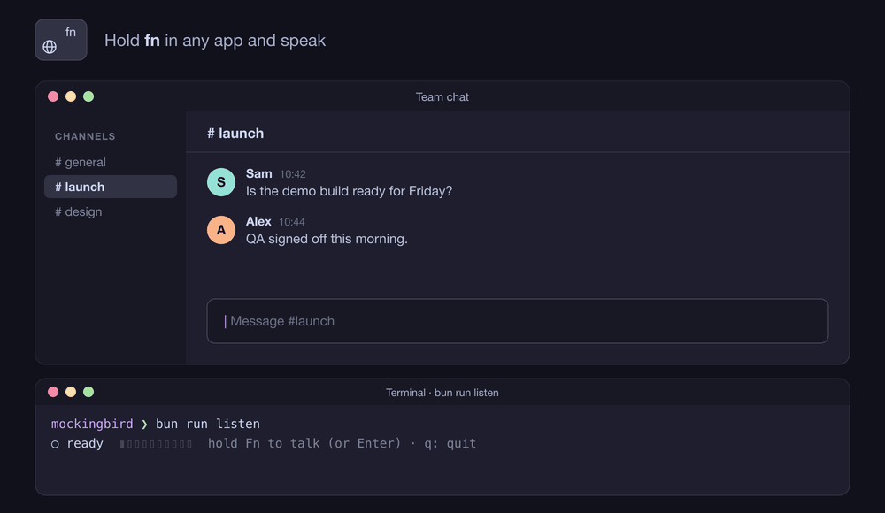

<h3 align="center">
  
  🐦 mockingbird
  
</h3>

<p align="center">
  Local voice dictation for macOS. Free forever, and your voice never leaves your Mac.
</p>

<p align="center">
  <a href="https://github.com/NirjharBhattacharjee/mockingbird/stargazers"></a>
  <a href="https://github.com/NirjharBhattacharjee/mockingbird/commits/main"></a>
  
  
  
  
  <a href="LICENSE"></a>
</p>

<p align="center">
  
</p>

<p align="center">
  
</p>

Speak, and get clean text back. Everything runs on your Mac: no account, no
cloud, no usage limits. A free, open-source alternative to Wispr Flow
([why](docs/PHILOSOPHY.md)).

> [!NOTE]
> **Early days.** Hold `Fn` anywhere, speak, and the text is typed into
> whatever app you're in. History, custom vocabulary and the dashboard are
> still to come.

## 🚀 Quick start

You need a Mac with Apple Silicon, [Homebrew](https://brew.sh), and about 3 GB of
free space.

**1. Install everything**

```sh
curl -fsSL https://raw.githubusercontent.com/NirjharBhattacharjee/mockingbird/main/scripts/install.sh | bash
```

This installs Bun, whisper-cpp, Ollama and ffmpeg, clones mockingbird into
`~/mockingbird`, downloads the models, and starts Ollama in the background
(it keeps running after a restart; stop it with `brew services stop ollama`).
It skips anything you already have, so it's safe to run again.
[Read the script](scripts/install.sh) first if you like.

<details>
<summary>Rather do it step by step?</summary>

```sh
# Tools (then open a new terminal window)
curl -fsSL https://bun.sh/install | bash
brew install whisper-cpp ollama ffmpeg

# Code
git clone https://github.com/NirjharBhattacharjee/mockingbird.git
cd mockingbird
bun install

# Models
mkdir -p ~/.mockingbird/models
curl -L -o ~/.mockingbird/models/ggml-base.en.bin \
  https://huggingface.co/ggerganov/whisper.cpp/resolve/main/ggml-base.en.bin
curl -L -o ~/.mockingbird/models/silero_vad.onnx \
  https://github.com/snakers4/silero-vad/raw/master/src/silero_vad/data/silero_vad.onnx

# Ollama: run `ollama serve` in a second window and leave it open, then:
ollama pull qwen3:4b-instruct-2507-q4_K_M
```

</details>

**2. Talk to it**

```sh
cd ~/mockingbird
bun run listen
```

Leave it running, click into any app (Slack, Notes, a browser), then hold
**Fn**, speak, and let go: your words are typed where your cursor is. (Enter
works too, for this terminal.) The first time, click **Allow** when macOS asks
for the microphone, and see [Usage](#-usage) for the two permissions `Fn` and
typing need.

## 🎤 Usage

### `bun run listen`: talk live

| Key | Does |
|---|---|
| **Fn** (hold) | Record while held, from any app |
| **Fn** (double-tap) | Record hands-free until you press **Fn** again |
| **Enter** / **Space** | Start or stop recording (this terminal only) |
| **Esc** | Cancel the recording |
| **q** | Quit |

Whatever you say is typed into the app in front (Slack, your editor, a
browser) and printed here too. Use `--no-type` to only print it.

**Two permissions are needed**, both in System Settings → Privacy & Security:

| Permission | For |
|---|---|
| **Input Monitoring** | noticing the `Fn` key |
| **Accessibility** | typing into other apps |

Switch on the app you run `bun run listen` from (Terminal, Ghostty, iTerm, VS
Code…) in both. If it isn't in the list, click **+** and add it from
Applications. Then **quit that app completely and reopen it**: press **Cmd+Q**
until its Dock icon has no dot under it. Closing its windows isn't enough;
macOS only applies the new permissions when the app restarts.

Without them, Enter still records and the text is printed here.

<details>
<summary>Fn still not working?</summary>

- **`listen` says "Fn key off".** The app you ran it from doesn't have Input
  Monitoring yet, or hasn't been fully quit and reopened since you allowed it.
  Each terminal app needs its own permission: allowing VS Code doesn't cover
  Ghostty.
- **Holding Fn opens emoji or Apple's dictation.** In System Settings →
  Keyboard, set **Press 🌐 key to** to **Do Nothing**.
- **Text is typed twice.** `bun run listen` is running in two windows. Quit
  one with `q`.

</details>

To check typing on its own:

```sh
bun run type --check          # is typing allowed? which app is in front?
bun run type "hello there"    # waits 3s, then types into the app you click
```

Using the wrong microphone? List them and pick one:

```sh
bun run listen --list-devices
bun run listen --device 2
```

### `bun run transcribe`: turn a recording into text

```sh
bun run transcribe ~/Desktop/memo.mp3
bun run transcribe ~/Desktop/memo.mp3 | pbcopy   # copy the text
```

Works with mp3, m4a, wav, and anything else ffmpeg can open. Tip: type
`bun run transcribe `, then drag the file into the terminal.

<details>
<summary>More options</summary>

Both commands accept:

| Option | Does |
|---|---|
| `--terminal` | No period at the end (for pasting commands) |
| `--json` | Show everything: raw and cleaned text, timings |
| `--help` | Show help |

Environment variables:

| Variable | Default |
|---|---|
| `MOCKINGBIRD_HOME` (where `models/` is) | `~/.mockingbird` |
| `MOCKINGBIRD_ASR_PORT` | `8771` |
| `MOCKINGBIRD_LLM_URL` | `http://127.0.0.1:11434` |
| `MOCKINGBIRD_LLM_MODEL` | `qwen3:4b-instruct-2507-q4_K_M` |

</details>

## 🩹 Troubleshooting

| Problem | Fix |
|---|---|
| `Script not found` | Run it from inside the `mockingbird` folder. |
| `permission denied` on a file | Put `bun run transcribe ` in front of the file path. |
| `recording was completely silent` or stuck on `waiting for the microphone` | Allow your terminal in **System Settings → Privacy & Security → Microphone**, then restart the terminal. |
| The level bars don't move | Wrong microphone. Use `--list-devices` and `--device`. |
| `Fn key off` or `Fn` does nothing | Allow your terminal in **System Settings → Privacy & Security → Input Monitoring**, then quit it with Cmd+Q and reopen. |
| Text prints but isn't typed into the app | Allow your terminal in **Accessibility** (same settings page), quit with Cmd+Q, reopen. Check with `bun run type --check`. |
| `Ollama isn't running` | Run `brew services start ollama` (or `ollama serve` in another window). You still get text, just not cleaned up. |
| `Whisper model not found` | Run the install command again. |
| `command not found: bun` | Open a new terminal window. |

The first run pauses for about 15 seconds while macOS prepares the GPU. After
that it's quick.

## 🗺️ Roadmap

| | |
|---|---|
| ✅ | Speech to text, cleanup (removes "um", fixes punctuation) |
| ✅ | Live microphone with `bun run listen` |
| ✅ | Transcribe recordings with `bun run transcribe` |
| ✅ | Hold `Fn` to talk, double-tap for hands-free |
| ✅ | Types into any app: Slack, editors, browsers, terminals |
| 🔲 | History and custom vocabulary |
| 🔲 | Terminal dashboard (Catppuccin themed) |
| 🔲 | `brew install mockingbird` |

## 🔒 Privacy

- Your audio and text never leave your Mac.
- mockingbird makes no internet requests. The only downloads are the ones you
  run in the quick start.
- Nothing is saved to disk. Live audio is kept in memory only (the last 30
  seconds). While `listen` runs, macOS shows the orange microphone dot.
- Typing uses key events, not the clipboard, so yours is never touched. Line
  breaks are removed first, so dictation can't send a message or run a command
  by itself.

More: [docs/SECURITY_PRIVACY.md](docs/SECURITY_PRIVACY.md)

## 🛠️ Development

| Command | Does |
|---|---|
| `bun test` | Unit tests |
| `bun run test:integration` | All tests, using the real models |
| `bun run typecheck` | Type-check |
| `bun run lint` / `bun run format` | Check / fix style |
| `bun run type --check` | Check typing permission and the app in front |
| `bun run demo` | Redraw the GIF above (needs `brew install librsvg`) |

Code lives in `apps/daemon` (the commands) and `packages/` (audio, voice
detection, speech-to-text, cleanup). The agent skills are a submodule in
`agent-skills/`; see [AGENTS.md](AGENTS.md).

## 📚 Docs

[Philosophy](docs/PHILOSOPHY.md) ·
[Architecture](docs/ARCHITECTURE.md) ·
[Models](docs/MODELS.md) ·
[Security & privacy](docs/SECURITY_PRIVACY.md) ·
[Database](docs/DATABASE.md) ·
[Terminal UI](docs/TUI.md)

## 💜 Contributing

Everyone is welcome. Start with [CONTRIBUTING.md](CONTRIBUTING.md). AI agents
should also read [AGENTS.md](AGENTS.md). Security issues go through
[SECURITY.md](SECURITY.md), not public issues.

## 📄 License

[MIT](LICENSE). Use it, change it, share it.

<p align="center">
  
</p>

<p align="center">
  Theme colors from <a href="https://github.com/catppuccin/catppuccin">Catppuccin</a>.
</p>
