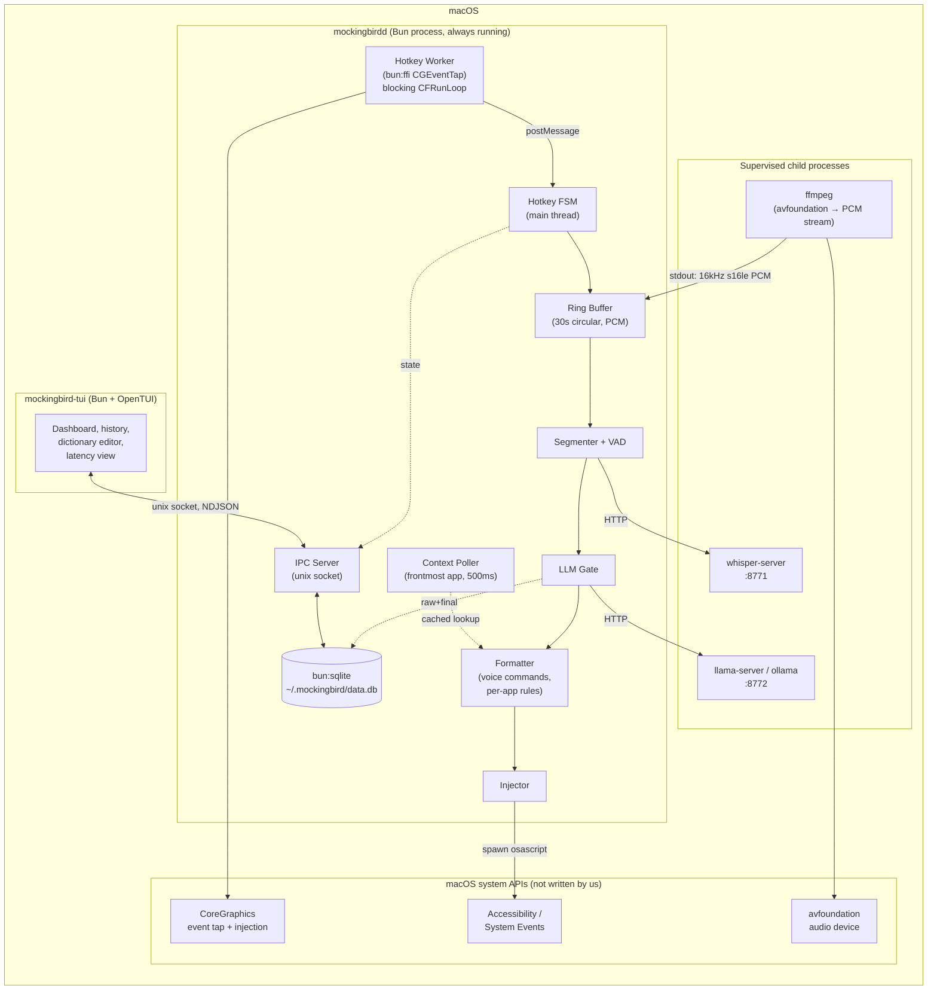
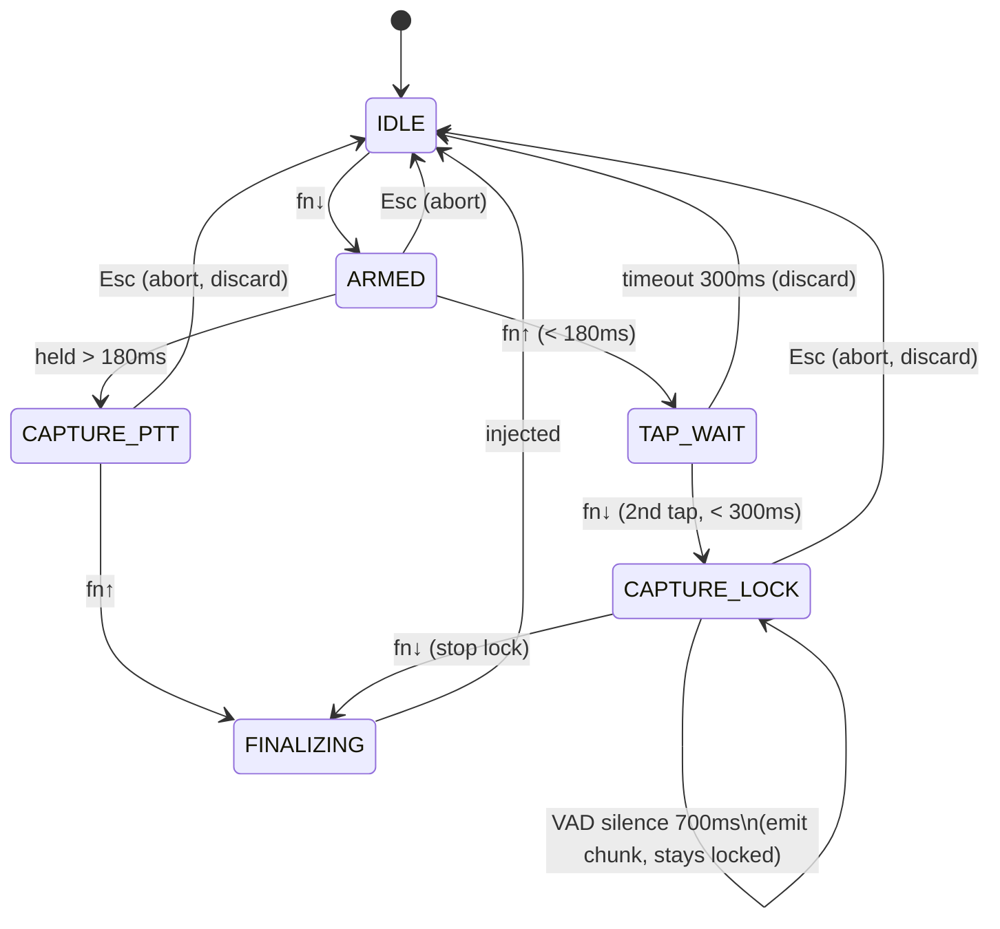
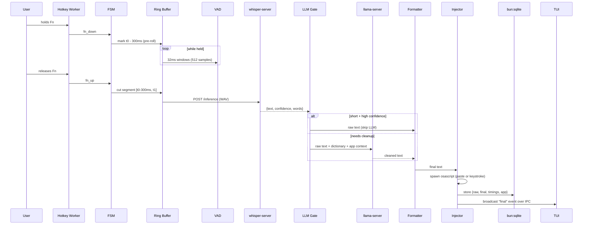
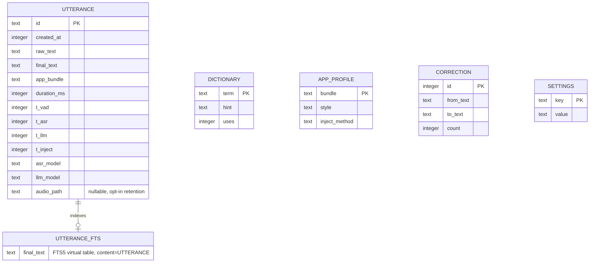
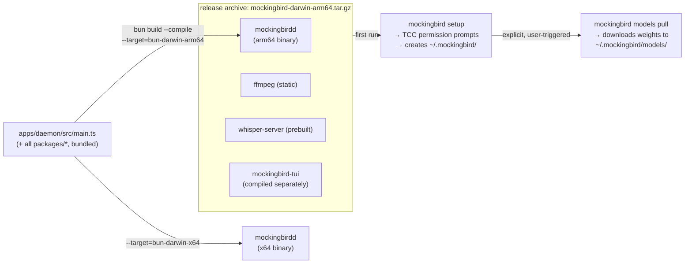
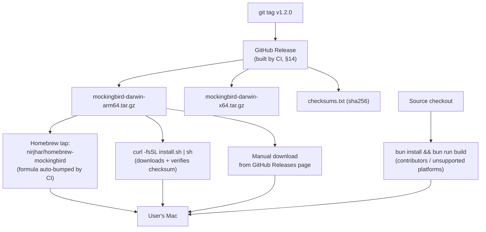
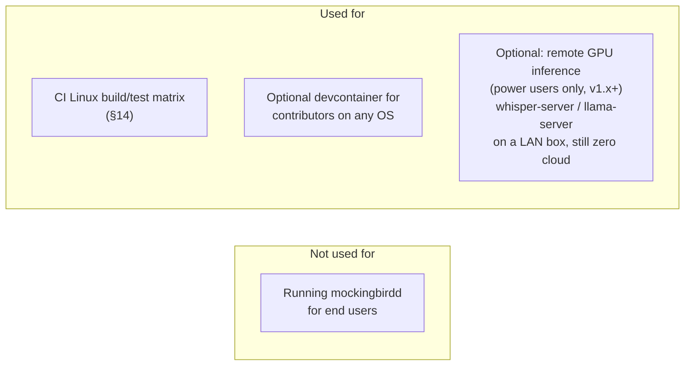
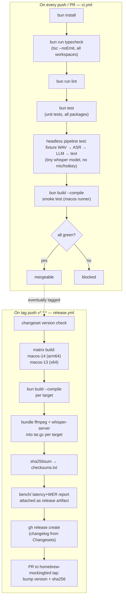

# mockingbird — architecture bible

> **Status:** v1 in progress — the pipeline (VAD → ASR → LLM → format), live microphone capture, the Fn hotkey FSM, text injection, and a `mockingbird` CLI that runs as a login agent exist; IPC, storage and the TUI do not yet.
> **Owner:** bhattacharjeenirjhar26@gmail.com
> **Last updated:** 2026-09-20

This document is the single source of truth for what mockingbird is, what it's
built from, and why. It is written to be read cover to cover once, then used
as a reference. When architecture changes, this file changes in the same PR —
it is not a design doc that gets abandoned once code exists.

## Changelog

| Date | Change |
|---|---|
| 2026-09-15 | Initial version. Stack finalized as TypeScript + Bun, no Electron, no Swift, no Docker for the shipped app. |
| 2026-09-16 | `packages/llm` scoped to a provider interface + adapters (Ollama, `llama-server`), matching the existing `asr`/`inject` pattern — stays in-process, not a separate service (§6, §10). |
| 2026-09-16 | Workspace bootstrapped; headless pipeline built in `packages/{audio,vad,asr,llm}` and `apps/daemon/src/pipeline.ts`. Corrected from measurement: VAD windows are 32ms (Silero v5 needs 512 samples), ASR returns `confidence` not `avgLogprob`, whisper-server's endpoint is `/inference`, warm LLM cleanup is ~1.1s not ~200ms (§6). Lint tool: Biome (§14). |
| 2026-09-16 | `bun run transcribe <file>` (`apps/daemon/src/transcribe.ts`) runs the pipeline on a recording. `packages/audio` now also decodes non-WAV input by piping it through ffmpeg, so ffmpeg is used for file decoding as well as capture (§3, §10). |
| 2026-09-17 | Live capture: `packages/audio` streams the microphone through ffmpeg into a 30s `RingBuffer`; `apps/daemon` adds the restart `Supervisor` (backoff 250ms→5s, gives up after 5 quick failures), a `Recorder` (300ms pre-roll, 2-minute cap), and `bun run listen`, a keyboard push-to-talk stand-in for the Fn FSM (§5, §10, §16). |
| 2026-09-17 | License decided: MIT (`LICENSE`). The §16 license gap now only covers the licenses of binaries a release archive would bundle. |
| 2026-09-18 | Text injection: `packages/inject` types text into the focused app as Unicode key events (`CGEventKeyboardSetUnicodeString` + `CGEventPost` via `bun:ffi`), and `packages/context` reads the frontmost app with `lsappinfo`. Decided against the planned clipboard-paste/`osascript` route: typing Unicode directly needs no clipboard (nothing to clobber or restore) and no AppleScript. Text is sanitized first — newlines become spaces, so dictation can never submit a message or run a shell command (§3, §10). |
| 2026-09-18 | Fn hotkey works, via a CoreGraphics event tap through `bun:ffi` in a worker thread (`packages/hotkey`) plus the §5 state machine (`apps/daemon/src/hotkey-fsm.ts`), wired into `bun run listen`. Measured: `uiohook-napi` panics Bun 1.4.2 (`unsupported uv function: uv_cond_init`), so it's out; macOS reports Fn as `flagsChanged` keycode 63 with flag `0x800000`. The tap is listen-only and discards every key except Fn and Esc (§3, §5, §10). |
| 2026-09-18 | `startEngines` starts `ollama serve` itself when nothing answers at a local `MOCKINGBIRD_LLM_URL`, and stops it on close; an Ollama that was already running (desktop app, Homebrew service) is left alone. The model is loaded in the background while whisper-server starts. `scripts/install.sh` sets everything up in one command and only runs Ollama for the model pull. |
| 2026-09-20 | `mockingbird` is now one command (`apps/daemon/src/cli.ts`) with `start`/`stop`/`restart`/`status` plus the existing `listen`/`transcribe`/`type`. `start` installs a launchd LaunchAgent (`com.mockingbird.agent`, `RunAtLoad`) that runs `apps/daemon/src/agent.ts` headless; `stop` disables it, which is what survives a reboot. The wiring both modes share moved to `apps/daemon/src/session.ts`, leaving `listen.ts` as the terminal UI. Transcribed text is now printed only when it couldn't be typed. The LLM is no longer loaded at startup — it's warmed on Fn-down instead, so an idle agent holds no model. The agent runs as `~/.mockingbird/bin/mockingbird`, a copy of the bun binary re-signed under our own identifier, so macOS names the permission after mockingbird rather than bun. Measured: `bun build --compile` is not yet an option — it embeds the `onnxruntime-node` addon but not the `libonnxruntime.1.dylib` it links against, so VAD fails at runtime (§8, §10, §11, §16). |


---

## Table of contents

1. [What this is](#1-what-this-is)
2. [Core principles](#2-core-principles)
3. [Technology stack](#3-technology-stack)
4. [System architecture](#4-system-architecture)
5. [The hotkey state machine](#5-the-hotkey-state-machine)
6. [The dictation pipeline](#6-the-dictation-pipeline)
7. [Where SQLite fits](#7-where-sqlite-fits)
8. [State ownership map](#8-state-ownership-map)
9. [Everything is local](#9-everything-is-local)
10. [Repository layout](#10-repository-layout)
11. [Packaging](#11-packaging)
12. [Deployment / distribution](#12-deployment--distribution)
13. [Is Docker needed?](#13-is-docker-needed)
14. [CI/CD pipeline](#14-cicd-pipeline)
15. [v1 scope](#15-v1-scope)
16. [Known gaps — scope not yet decided](#16-known-gaps--scope-not-yet-decided)
17. [Versioning & how this doc evolves](#17-versioning--how-this-doc-evolves)

---

## 1. What this is

mockingbird is a local, open-source, voice-to-text dictation tool. Press and
hold a hotkey (Fn on macOS by default), speak, release — the transcribed,
cleaned-up text is typed into whatever field has focus, in any application
(terminal, browser, editor, anything). Double-tap the hotkey to lock into
hands-free dictation until pressed again.

It is explicitly positioned as a local alternative to tools like Wispr Flow:
no audio or text ever leaves the machine, no account, no cloud model calls.

Target platform for v1 is **macOS only**. Windows and Linux are designed for
but not built in v1 — see [§16](#16-known-gaps--scope-not-yet-decided).

## 2. Core principles

These are constraints, not preferences. Any proposed change should be checked
against this list.

1. **100% TypeScript, authored by us.** Every file we write and maintain is
   `.ts`, running on Bun. Third-party binaries we depend on (ffmpeg, an ASR
   server, an LLM server) are consumed as subprocesses or prebuilt native
   modules — never hand-written by us in another language. See [§3](#3-technology-stack)
   for the exact boundary.
2. **No Electron, no Swift, no native GUI toolkit.** Bun is the only runtime.
   Feedback is audio cues + a terminal UI (OpenTUI), not a windowed app.
3. **Local-first, no exceptions.** No network call happens as part of normal
   operation. The only network activity in the entire system is an explicit,
   user-initiated model download. See [§9](#9-everything-is-local).
4. **Headless-testable core.** The pipeline (VAD → ASR → LLM → format) must
   run and be tested with zero OS integration — feed it a WAV file, assert on
   text. Platform-specific code (hotkey, injection, context) is isolated
   behind narrow interfaces so it can be swapped or mocked.
5. **Degrade, don't break.** If the LLM cleanup server dies, dictation falls
   back to raw ASR output instead of stopping. If ffmpeg dies, it restarts.
   The user should almost never see dictation simply stop working.

## 3. Technology stack

| Concern | Technology | Version (verified) | Runs as |
|---|---|---|---|
| Language / runtime | TypeScript on **Bun** | Bun ≥ 1.2 | our process |
| Package manager / workspaces | Bun workspaces | — | — |
| Microphone capture, audio file decoding | `ffmpeg` (avfoundation on macOS) | system binary | subprocess, piped stdout |
| Global hotkey | **`bun:ffi` → CoreGraphics event tap** (`uiohook-napi` crashes Bun, see §16) | — | FFI in a worker thread |
| Voice activity detection | Silero VAD via `onnxruntime-node` | — | native module in-process |
| Speech-to-text (ASR) | `whisper.cpp` (`whisper-server`), model: `large-v3-turbo` Q5_0 | — | subprocess, HTTP :8771 |
| Cleanup / formatting LLM | Ollama **or** `llama-server` (llama.cpp), model: Qwen3-4B-Instruct Q4 | Ollama v0.11.4 (Go) | subprocess, HTTP :8772 |
| Text injection | **`bun:ffi` → `CGEventKeyboardSetUnicodeString` + `CGEventPost`** | — | FFI, in-process |
| Frontmost app | `lsappinfo` (needs no TCC grant, unlike System Events) | system binary | subprocess |
| Persistent storage | **`bun:sqlite`** (built into Bun) + `sqlite-vec` extension | bundled with Bun | in-process, embedded |
| Terminal UI | `@opentui/react` | 0.5.11 | separate Bun process |
| Validation / IPC contract | `zod` + hand-written protocol types | — | shared package |
| Testing | `bun test` | built-in | — |
| Release versioning | Changesets | — | — |

**The rule that resolves "is X allowed":** if we call it via `fetch()`,
`Bun.spawn()`, or install it as a prebuilt N-API module, it's fine regardless
of what language it's written in internally — we never read or compile its
source. If we would need to write a `.swift`, `.mm`, `.go`, or `.rs` file
ourselves to make it work, it's out, full stop, for v1.

Ollama being written in Go is not a stack violation for the same reason
Postgres being written in C isn't one for a Node web app: it's a server we
talk HTTP to.

## 4. System architecture



Two processes are ours to run at all times: **mockingbirdd** (the daemon —
always on, owns all state) and, optionally, **mockingbird-tui** (attaches and
detaches freely, holds no source of truth). Three more are supervised
children the daemon manages: **ffmpeg**, **whisper-server**, **llama-server**.

## 5. The hotkey state machine



`TAP_WAIT`'s 300ms window is what distinguishes a double-tap (lock mode) from
two rapid push-to-talks. This FSM lives entirely on the daemon's main thread
and is the single source of truth for what mockingbird is currently doing —
the TUI only ever displays it, never owns a copy of it.

## 6. The dictation pipeline



Pre-roll (starting capture 300ms *before* the key registers, using the
always-running ring buffer) is what prevents the first syllable of every
utterance from being clipped. The same 300ms is used as padding when VAD trims
a segment before ASR; 100ms was measured to cut soft onsets like "um". The LLM
gate exists so a two-word confirmation like "yes please" doesn't pay LLM
latency it doesn't need. That latency is larger than first assumed: measured
on an Apple M3, warm Qwen3-4B Q4 cleanup of a 13-word sentence takes ~1.1s,
against ~0.2s for `base.en` ASR (see the integration test in
`apps/daemon/test/pipeline.integration.test.ts`).

`confidence` is the mean probability of the spoken (non-punctuation) words
whisper-server returns; whisper.cpp exposes per-word probabilities, not an
average log-probability. The gate currently skips the LLM for utterances of
at most 4 words with confidence ≥ 0.7. Both thresholds were tuned on synthetic
`say` speech only and need retuning on real recordings once `bench/` exists.

`packages/llm` sits behind a single provider interface (`complete()`,
`health()`), with thin adapters per backend (Ollama, `llama-server`, and
later a remote-LAN target per [§13](#13-is-docker-needed)) — the same
interface-plus-adapter shape `packages/asr` and `packages/inject` already
use. This is what makes the base-URL/model swap in [§3](#3-technology-stack)
and the fallback-to-raw-ASR behavior in [§2](#2-core-principles) (point 5) a
property of one small class instead of logic scattered across the Gate. It
stays in-process inside `mockingbirdd` — this is *not* a separate service or
process; that's a deliberate scope cut, tracked as a possible future step
only if a second consumer beyond mockingbird ever needs the LLM independently
of the dictation daemon's lifecycle.

## 7. Where SQLite fits

SQLite — via `bun:sqlite`, built into Bun with zero external dependency — is
**the entire persistence and memory layer**. This replaces the Redis idea
from the original concept: Redis would mean shipping and supervising a
separate daemon and a port, for data that's actually structured, queryable,
and wanted durable — not cache-shaped. `bun:sqlite` gives us that in one file
with no extra process.



What lives in it:

- **`utterance`** — every transcription, both `raw_text` (straight from ASR)
  and `final_text` (after LLM + formatting), plus per-stage timings. This is
  what powers the TUI's latency waterfall and the raw-vs-cleaned diff view.
- **`utterance_fts`** — FTS5 virtual table for instant full-text search over
  history in the TUI.
- **`dictionary`** — user vocabulary (proper nouns, jargon, codenames) fed
  into the LLM prompt as context.
- **`app_profile`** — per-application formatting rules (e.g. Terminal gets no
  auto-capitalization; Slack stays casual) and the preferred injection method
  for that app.
- **`correction`** — learned from user edits after the fact, this is the
  closest thing to "memory" the system has: patterns of what gets corrected
  feed back into dictionary suggestions.
- **`settings`** — everything configurable: active hotkey binding, ASR/LLM
  model choice, lock-mode silence threshold, etc.

**Vector memory (optional, v1.x):** the `sqlite-vec` extension loads directly
into the same database file via `db.loadExtension()`, giving semantic search
over utterance history and dictionary terms without a separate vector store.

**Concurrency model:** only the daemon writes; the TUI reads. WAL mode is
enabled so the TUI can query history/search while the daemon is actively
writing a new utterance, with no lock contention.

## 8. State ownership map

Every piece of state in the system has exactly one owner. This table is the
tie-breaker any time it's unclear where something should live.

| State | Lives in | Persisted? | Owner |
|---|---|---|---|
| Current FSM state (IDLE/ARMED/CAPTURING/...) | Daemon main-thread memory | no | daemon |
| Live audio (last 30s) | Ring buffer, daemon memory | no | daemon |
| In-flight session (current utterance being processed) | Daemon memory | no | daemon |
| Frontmost app cache | Daemon memory, refreshed every 500ms | no | daemon |
| Utterance history, timings | `bun:sqlite` | **yes** | daemon (writer) |
| Dictionary / vocabulary | `bun:sqlite` | **yes** | daemon (writer) |
| Per-app formatting rules | `bun:sqlite` | **yes** | daemon (writer) |
| User settings (hotkey binding, model choice) | `bun:sqlite` | **yes** | daemon (writer) |
| ASR model weights | `~/.mockingbird/models/` (flat files) | yes, on disk | filesystem |
| LLM model weights | `~/.mockingbird/models/` (flat files) | yes, on disk | filesystem |
| Bundled binaries (ffmpeg, whisper-server) | `~/.mockingbird/bin/` | yes, on disk | filesystem |
| Logs | `~/.mockingbird/logs/` | yes, rotated | filesystem |
| Unix socket, PID file | `~/.mockingbird/` | yes (ephemeral, deleted on clean stop) | filesystem |
| ASR model weights **in RAM** | `whisper-server` process memory | no | child process |
| LLM weights **in RAM/VRAM** | `llama-server`/Ollama process memory | no | child process |
| TUI view state (scroll position, active tab) | TUI process memory | no, or tiny local prefs file | TUI |
| macOS permission grants (Mic, Accessibility, Input Monitoring) | TCC database | yes | **macOS itself**, not us |

The single rule this enforces: **the daemon is the only writer to durable
state.** The TUI, and any future client, is a read-only view over IPC plus
direct read-only SQLite queries. This is what makes "headless-testable core"
in [§2](#2-core-principles) actually true — you can kill every UI and the
system still fully works from a script talking to the socket.

## 9. Everything is local

This is a hard product guarantee, not an aspiration, and it should be
verifiable, not just promised.

- **No cloud ASR, no cloud LLM.** Transcription and cleanup run on-device via
  `whisper-server` and `llama-server`/Ollama, both bound to `127.0.0.1` only.
- **No telemetry, no analytics, no crash reporting phones home.** If we ever
  add opt-in anonymous usage stats, it is default-off and requires an
  explicit, separate opt-in — never bundled into a general "yes" during
  onboarding.
- **No account, no login, no license server.**
- **The only network activity in the entire system is model download**,
  which is user-triggered (`mockingbird models pull <name>`), shows exactly
  what URL it's fetching from (Hugging Face / ggml model repos), and never
  happens silently in the background.
- **Audio never leaves the ring buffer** unless the hotkey fires a capture.
  The ring buffer itself never touches disk unless the user explicitly
  enables audio retention (`audio_path` in the schema is nullable and off by
  default) for debugging/training-their-own-dictionary purposes.
- **The IPC socket is a Unix domain socket with `0600` permissions**, not a
  TCP port — nothing on the network, even the local network, can reach it.
- **Enforced, not just claimed:** the shipped binary requests no outbound
  network entitlement beyond what's needed for the explicit model-download
  command. Anyone can `lsof -i` while dictating and see nothing outbound.

## 10. Repository layout

```
mockingbird/
├── docs/
│   ├── README.md
│   └── ARCHITECTURE.md          ← this file
├── apps/
│   ├── daemon/                  mockingbirdd — supervisor, FSM, IPC server
│   │   └── src/
│   │       ├── cli.ts           `mockingbird` — the one command users run
│   │       ├── agent.ts         headless entry launchd runs (no TTY)
│   │       ├── agent/plist.ts   LaunchAgent plist, as a pure function
│   │       ├── agent/launchctl.ts  launchctl argv + output parsing
│   │       ├── session.ts       engines + capture + Fn + pipeline, no UI
│   │       ├── hotkey-fsm.ts     Fn hold / double-tap state machine (§5)
│   │       ├── supervisor.ts    child process lifecycle + restart policy
│   │       ├── recorder.ts      ring buffer → recordings, with pre-roll and a length cap
│   │       ├── pipeline.ts      VAD → ASR → LLM gate → format
│   │       ├── runtime.ts       model checks, engine startup shared by the CLIs
│   │       ├── transcribe.ts    `bun run transcribe <file>` CLI
│   │       ├── listen.ts        `bun run listen` CLI (keyboard push-to-talk)
│   │       ├── listen-controller.ts
│   │       └── main.ts
│   └── tui/                     mockingbird-tui — OpenTUI client, IPC only
├── packages/
│   ├── protocol/                shared IPC types + zod schemas
│   ├── audio/                   ring buffer, ffmpeg capture + file decoding, per-OS args
│   ├── vad/                     Silero ONNX wrapper
│   ├── asr/                     engine interface + whisper-server adapter
│   ├── llm/                     provider interface + adapters (Ollama,
│   │                            llama-server), prompt assembly, per-app
│   │                            profiles, caching
│   ├── hotkey/                  CGEventTap via bun:ffi, run in a worker thread
│   ├── inject/                  types text as Unicode key events (x11/win32 later)
│   ├── context/                 frontmost app via lsappinfo, terminal detection
│   └── store/                   bun:sqlite, migrations, FTS5, sqlite-vec
├── bench/                       WER + latency harness over a fixed corpus
├── scripts/                     setup, model download, release packaging
├── .github/workflows/           CI/CD — see §14
├── package.json                 Bun workspace root
├── bunfig.toml
└── LICENSE
```

Two structural rules, unchanged from earlier design passes and still load-
bearing:

1. `packages/*` never imports from `apps/*`.
2. Every platform-specific concern is hidden behind `asr`, `inject`,
   `context`, and `audio` — the entire Windows/Linux port surface later.

## 11. Packaging

Bun compiles a TypeScript project into a **single, self-contained native
executable** with `bun build --compile` — the Bun runtime is embedded, so end
users need not install Bun themselves.



What's **compiled into** the binary: all of our TypeScript, across every
`packages/*`. What's **bundled alongside it** in the release archive: ffmpeg
and whisper-server as prebuilt platform binaries — small enough to ship,
needed on every run. What's **downloaded separately, on demand**: model
weights (hundreds of MB to a few GB) — too large to bundle, and the user
should get to choose which ASR/LLM size fits their machine.

`mockingbird-tui` is compiled as its own binary from `apps/tui`, since it's a
genuinely separate process the user may or may not run.

## 12. Deployment / distribution

There is no server-side "deployment" — this is a desktop tool, so
"deployment" means **getting a binary onto the user's machine**.



Primary channel for v1 is a **Homebrew tap** (`brew install nirjhar/mockingbird/mockingbird`)
since the target user is a developer on macOS. A `curl | sh` installer is the
fallback for anyone without Homebrew. Building from source via `bun install`
is always supported and is how contributors and unsupported architectures
run it.

## 13. Is Docker needed?

**Not for the shipped app — and it can't be, structurally.** The daemon needs
direct host access to: the microphone, the Accessibility/Input-Monitoring TCC
grants, and the ability to inject keystrokes into *other host GUI
applications*. None of that is reachable from inside a container. On macOS
specifically, Docker Desktop runs containers inside a Linux VM with no path
to host TCC-gated APIs at all — a containerized mockingbird literally cannot
dictate into your terminal, because your terminal isn't inside the
container.

So: **the end-user daemon is never containerized.** That's not a limitation
we're working around, it's a correct reflection of what this tool is.

Docker still earns a place in two auxiliary roles:



That last one (D) is worth naming explicitly since it's the one legitimate
future case: someone with a beefy GPU box on their home network might want to
run `whisper-server`/`llama-server` there instead of their laptop, and point
mockingbird at `http://192.168.x.x:8771` instead of `127.0.0.1`. That's still
"local" in the sense that matters (nothing leaves the user's own network, no
third party ever sees the data) — it's just not *the same machine*. This is
explicitly out of scope for v1 (default and only mode is single-machine,
`127.0.0.1`) but the `asr`/`llm` packages should be designed so the base URL
is configuration, not a hardcoded assumption, so this door isn't closed.

## 14. CI/CD pipeline

Two workflows: one that gates every change, one that ships releases.



**`ci.yml`** (runs on every PR and push to any branch):

1. `bun install` — deterministic via `bun.lock`.
2. Typecheck every workspace with `tsc --noEmit`.
3. Lint and format check with Biome (`biome.json`) — one fast binary, no
   separate Prettier.
4. `bun test` across all `packages/*` — this is where the FSM, ring buffer,
   formatter, and store logic get unit tested with zero OS dependency.
5. **Headless pipeline integration test** — the one that matters most: feed a
   committed fixture WAV through the real `asr` → `llm` → formatter chain
   (using a small/fast model in CI, not the shipping-size one) and assert on
   output. This is only possible because of the "headless-testable core"
   principle in [§2](#2-core-principles) — no hotkey, no mic, no injection
   needed to test 90% of the interesting logic.
6. A `bun build --compile` smoke test on a macOS runner — catches bundling
   breakage before release day.

**`release.yml`** (runs on `v*.*.*` tag push):

1. Build the compiled binaries for each macOS target in a matrix.
2. Bundle the platform-appropriate ffmpeg/whisper-server binaries alongside.
3. Generate checksums.
4. Run the `bench/` harness and attach its report to the release — so every
   release has a recorded latency/WER baseline, and regressions are visible
   in the release history itself, not just in someone's terminal.
5. Create the GitHub Release with a changelog generated by **Changesets**
   (contributors add a changeset describing their change; release CI
   aggregates them into the changelog and bumps versions across the
   workspace).
6. Open an automated PR against the `homebrew-mockingbird` tap repo bumping
   the formula's version and sha256 — reviewed and merged by us, not
   auto-merged, at least until the process has proven itself.

**Branch protection:** once this repo is pushed to GitHub, `main` should
require `ci.yml` green before merge, and releases should only ever be cut
from tags on `main`.

**Why Changesets specifically:** this is a multi-package Bun workspace
(`packages/protocol`, `packages/asr`, etc.) and Changesets is built for
exactly that shape — each PR declares which packages it bumped and why, and
release tooling turns the accumulated changesets into both version bumps and
a human-readable changelog, without hand-writing either.

## 15. v1 scope

What "v1" concretely means, so "this project will be made better with time"
has a fixed line to improve past:

- macOS only (arm64 primary, x64 best-effort).
- Fn key push-to-talk + double-tap lock mode.
- Local ASR (whisper.cpp) + local LLM cleanup (Ollama or llama.cpp), both
  swappable via config.
- Text injection into any focused field via clipboard-paste or synthetic
  keystrokes.
- Per-app formatting rules (at least Terminal vs. everything-else).
- User dictionary (manually edited).
- SQLite-backed history with full-text search, exposed via the TUI.
- OpenTUI dashboard: live state, latency waterfall, history browser,
  dictionary editor.
- Homebrew + curl installer distribution.
- No GUI app, no menubar icon, no floating HUD — audio cues + TUI only.

## 16. Known gaps — scope not yet decided

Flagged explicitly rather than silently deferred. Each of these needs an
actual decision before or during v1, not an assumption:

- **Licenses of bundled binaries.** mockingbird itself is MIT (decided
  2026-09-17, see `LICENSE`). Still open: checking every binary a release
  archive would bundle. whisper.cpp and llama.cpp are MIT, but a static
  ffmpeg build can be GPL depending on how it was configured (Homebrew's is
  built with `--enable-gpl`), which matters if it ships inside our archive.
- **Windows & Linux hotkey/inject/context backends.** Designed for (see
  [§10](#10-repository-layout)'s package boundaries) but not implemented.
  Notably: **Fn does not exist on Windows** (handled in keyboard firmware,
  never reaches the OS) — the default binding there must be something else
  entirely (e.g. double-tap Right Ctrl), not a Fn fallback.
- **Wayland.** No global shortcuts by design on Wayland compositors; needs
  `xdg-desktop-portal` GlobalShortcuts + `libei`/`uinput`, and support is
  compositor-uneven. Likely X11-only at first on Linux.
- **"Scratch that" / undo of already-injected text.** Only tractable via the
  keystroke-injection path (need to know exactly how many characters we
  typed to backspace them); the clipboard-paste path can't be undone this
  way. Needs a design decision, not just a TODO.
- ~~**Auto-launch on login.**~~ Settled 2026-09-20: `mockingbird start` writes
  `~/Library/LaunchAgents/com.mockingbird.agent.plist` with `RunAtLoad`, and
  `mockingbird stop` runs `launchctl disable`, whose state persists across
  reboots — so the plist stays on disk and the agent stays off until the next
  `start`. `KeepAlive` is `Crashed`-only, so a deliberate exit (no microphone,
  a missing model) doesn't relaunch every 10s forever. macOS attributes the Fn
  and typing permissions to the binary launchd runs, which is
  `~/.mockingbird/bin/mockingbird` — a copy of the bun binary re-signed under
  our own identifier, so the Privacy lists name mockingbird and `bun` itself
  stays unprivileged. What that copy costs is in SECURITY_PRIVACY §4; a truly
  compiled binary is still blocked on `onnxruntime-node`.
- **Auto-update.** Self-update command that checks GitHub Releases — must
  stay opt-in / explicit-confirm, never a silent background check, to hold
  the [§9](#9-everything-is-local) guarantee.
- **Diagnostics / bug reports.** An explicit `mockingbird diagnostics export`
  command bundling logs + config (never audio, never transcripts, unless the
  user opts in per-export) for attaching to a GitHub issue by hand — no
  automatic crash reporting.
- **Multi-language support.** Whisper itself is multilingual; our formatting
  rules, voice commands, and dictionary matching are currently English-only
  assumptions baked into the design.
- **Long-session memory bounds.** Partly settled: the ring buffer is fixed at
  30s (~1 MB), and a single push-to-talk recording stops growing at 2 minutes
  (`Recorder.maxRecordingMs`). Lock mode, which emits a chunk per silence
  instead of one recording, still needs its own cutoff.
- **Config surface.** Dictionary editing is planned in the TUI; broader
  settings (model choice, thresholds, hotkey rebinding) need either more TUI
  screens or a `mockingbird config` CLI — undecided which.
- **Device picker.** Partly settled: capture uses the system default input
  (avfoundation `:default`), and `bun run listen --list-devices` /
  `--device <n|name>` override it per run. Not yet decided: persisting the
  choice in `settings`, and following the system default when it changes
  while mockingbird is running (today that needs a restart).
- **Uninstall story.** What `brew uninstall` leaves behind in `~/.mockingbird/`
  (models, history, logs) and whether/how to offer full cleanup.

## 17. Versioning & how this doc evolves

This document is versioned alongside the code, not separately. Practically:

- Any PR that changes architecture, adds/removes a dependency, or changes
  where state lives **must** update the relevant section of this file in the
  same PR.
- The [Changelog](#changelog) table at the top gets a new row per
  architecturally-significant change, dated, one line.
- When a "known gap" in [§16](#16-known-gaps--scope-not-yet-decided) gets
  decided and built, it moves out of that list and into the relevant section
  above — the gap list should shrink over time, not just grow.
- Nothing here is precious. If reality diverges from this doc, the doc is
  wrong and gets fixed — treat contradictions between this file and the
  actual code as a bug against the doc, filed and fixed like any other.
