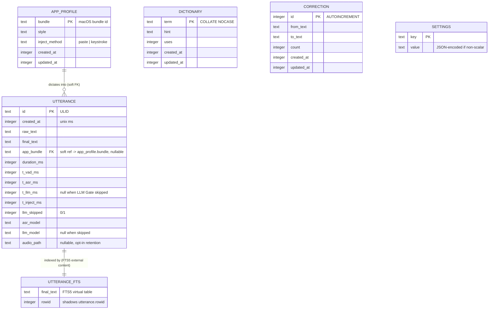

# mockingbird — database schema

> **Status:** v1 design, pre-code — elaborates
> [ARCHITECTURE.md §7](./ARCHITECTURE.md#7-where-sqlite-fits) into an actual
> DDL-level schema: column types, keys, constraints, and indexes. If code
> ends up differing from this file, this file is wrong and gets fixed in the
> same PR, per the rule in
> [ARCHITECTURE.md §17](./ARCHITECTURE.md#17-versioning--how-this-doc-evolves).
> **Owner:** bhattacharjeenirjhar26@gmail.com
> **Last updated:** 2026-09-16

`data.db`, at `~/.mockingbird/data.db`, is the entire persistence layer —
one SQLite file via `bun:sqlite`, no other database anywhere in the system.
This doc is the schema-level counterpart to
[ARCHITECTURE.md §7](./ARCHITECTURE.md#7-where-sqlite-fits) (why SQLite, at
a systems level) and
[SECURITY_PRIVACY.md §2](./SECURITY_PRIVACY.md#2-data-inventory--what-mockingbird-actually-touches)
(what's sensitive about this data and why). Read those first if you haven't
— this doc assumes the "why," and just goes deep on the "what."

## Table of contents

1. [Design goals for this schema](#1-design-goals-for-this-schema)
2. [Entity-relationship diagram](#2-entity-relationship-diagram)
3. [`utterance`](#3-utterance)
4. [`utterance_fts`](#4-utterance_fts)
5. [`dictionary`](#5-dictionary)
6. [`app_profile`](#6-app_profile)
7. [`correction`](#7-correction)
8. [`settings`](#8-settings)
9. [Keys & relationships summary](#9-keys--relationships-summary)
10. [Indexes](#10-indexes)
11. [Migrations](#11-migrations)
12. [WAL mode & concurrency](#12-wal-mode--concurrency)
13. [Retention & data lifecycle](#13-retention--data-lifecycle)
14. [Open schema decisions](#14-open-schema-decisions)

---

## 1. Design goals for this schema

- **One writer.** Only the daemon (`mockingbirdd`) ever writes. The TUI and
  any future client read only — see
  [state ownership map, ARCHITECTURE.md §8](./ARCHITECTURE.md#8-state-ownership-map).
  Nothing in this schema assumes multi-writer safety, on purpose.
- **Six tables, no more.** `utterance`, `utterance_fts`, `dictionary`,
  `app_profile`, `correction`, `settings`. Every table here earns its place
  by being read from a specific TUI screen or pipeline stage — see
  [DATABASE.md §2](#2-entity-relationship-diagram)'s cross-references and
  [TUI.md](./TUI.md) for who reads what.
- **Natural keys where a natural key exists** (`dictionary.term`,
  `app_profile.bundle`, `settings.key`) — no surrogate `id` column bolted on
  for its own sake. `utterance` and `correction` get surrogate keys because
  neither has a natural one.
- **Foreign keys are documented even where SQLite won't enforce them**, so
  the *intent* of the relationship is never in question even where a soft
  reference is the deliberate choice — see [§9](#9-keys--relationships-summary)
  for exactly which relationships are hard-enforced vs. soft.

## 2. Entity-relationship diagram



`dictionary`, `correction`, and `settings` have no foreign keys in or out —
they're independent dimension/config tables, read directly by the LLM
prompt-assembly step and the TUI, never joined against `utterance` at the
database level. (The LLM Gate reads `dictionary` and `app_profile` rows at
request time and inlines them into the prompt, per
[ARCHITECTURE.md §6](./ARCHITECTURE.md#6-the-dictation-pipeline) — that's an
application-level join, not a SQL one.)

## 3. `utterance`

The core fact table — one row per finalized dictation.

```sql
CREATE TABLE utterance (
  id            TEXT PRIMARY KEY,                -- ULID: sortable by time, generated app-side
  created_at    INTEGER NOT NULL,                 -- unix ms
  raw_text      TEXT NOT NULL,                    -- straight from whisper-server
  final_text    TEXT NOT NULL,                    -- after LLM cleanup + formatting (== raw_text if skipped)
  app_bundle    TEXT REFERENCES app_profile(bundle),
  duration_ms   INTEGER NOT NULL,                 -- length of the captured audio segment
  t_vad_ms      INTEGER,                          -- time in VAD/segmenting stage
  t_asr_ms      INTEGER,                          -- whisper-server round trip
  t_llm_ms      INTEGER,                          -- NULL when llm_skipped = 1
  t_inject_ms   INTEGER,                          -- osascript spawn + injection
  llm_skipped   INTEGER NOT NULL DEFAULT 0,        -- 0/1: did the LLM Gate skip cleanup?
  asr_model     TEXT NOT NULL,                    -- e.g. "whisper-large-v3-turbo-q5_0"
  llm_model     TEXT,                             -- NULL when llm_skipped = 1
  audio_path    TEXT                              -- NULL unless audio retention is opted in
);
```

- **`id` is a ULID, not an autoincrement integer.** It needs to be
  generateable app-side before the row is written (the TUI receives it over
  IPC in the "final" broadcast event, per
  [ARCHITECTURE.md §6](./ARCHITECTURE.md#6-the-dictation-pipeline), same
  instant as the DB write), and ULIDs sort chronologically as plain text,
  which keeps `ORDER BY id` and `ORDER BY created_at` equivalent without a
  second index.
- **`app_bundle` is a *soft* foreign key** — see [§9](#9-keys--relationships-summary)
  for why it isn't `NOT NULL` or hard-enforced.
- **`llm_skipped` is a real column, not inferred from `t_llm_ms IS NULL`.**
  Both facts happen to correlate today, but making "was cleanup skipped"
  an explicit boolean means the latency waterfall in the TUI (see
  [TUI.md](./TUI.md)) can render "skipped" distinctly from "ran in 0ms,"
  and a future change to timing granularity can't silently break the Gate
  skip-rate stat.
- **`audio_path`** stores a path under `~/.mockingbird/`, not the audio
  itself — the actual WAV/PCM file lives on the filesystem, off by default.
  See [SECURITY_PRIVACY.md §5](./SECURITY_PRIVACY.md#5-at-rest-storage--retention).

## 4. `utterance_fts`

```sql
CREATE VIRTUAL TABLE utterance_fts USING fts5(
  final_text,
  content='utterance',
  content_rowid='rowid'
);
```

- This is an **external-content FTS5 table** — it doesn't duplicate
  `final_text`'s storage, it indexes the copy that already lives in
  `utterance`. That's why `utterance` must **not** be declared
  `WITHOUT ROWID`: FTS5's `content_rowid` linkage needs the implicit rowid
  SQLite gives every ordinary table, even though `utterance`'s actual
  primary key is the `TEXT id` column.
- External-content tables don't auto-sync — three triggers keep it correct:

  ```sql
  CREATE TRIGGER utterance_ai AFTER INSERT ON utterance BEGIN
    INSERT INTO utterance_fts(rowid, final_text) VALUES (new.rowid, new.final_text);
  END;

  CREATE TRIGGER utterance_ad AFTER DELETE ON utterance BEGIN
    INSERT INTO utterance_fts(utterance_fts, rowid, final_text) VALUES('delete', old.rowid, old.final_text);
  END;

  CREATE TRIGGER utterance_au AFTER UPDATE ON utterance BEGIN
    INSERT INTO utterance_fts(utterance_fts, rowid, final_text) VALUES('delete', old.rowid, old.final_text);
    INSERT INTO utterance_fts(rowid, final_text) VALUES (new.rowid, new.final_text);
  END;
  ```
- Only `final_text` is indexed — not `raw_text`. Searching history is a
  user-facing feature (the TUI's history browser, see
  [TUI.md](./TUI.md)); the raw pre-cleanup transcript is diagnostic data,
  not something users are expected to search by.

## 5. `dictionary`

```sql
CREATE TABLE dictionary (
  term        TEXT PRIMARY KEY COLLATE NOCASE,   -- "Nirjhar" and "nirjhar" are the same row
  hint        TEXT,                              -- pronunciation/usage note fed into the LLM prompt
  uses        INTEGER NOT NULL DEFAULT 0,
  created_at  INTEGER NOT NULL,
  updated_at  INTEGER NOT NULL
);
```

- `term` is the natural key — user vocabulary (proper nouns, jargon,
  codenames), per
  [ARCHITECTURE.md §7](./ARCHITECTURE.md#7-where-sqlite-fits). `COLLATE
  NOCASE` prevents silently accumulating case-variant duplicates of the same
  word.
- `uses` increments each time the LLM Gate includes this term in a prompt
  and the resulting transcript actually contains it — this is what lets the
  dictionary editor in the TUI sort by "most relevant," not just
  alphabetically.

## 6. `app_profile`

```sql
CREATE TABLE app_profile (
  bundle          TEXT PRIMARY KEY,                       -- e.g. "com.apple.Terminal"
  style           TEXT NOT NULL DEFAULT 'default',          -- formatting ruleset name
  inject_method   TEXT NOT NULL DEFAULT 'paste'             -- 'paste' | 'keystroke'
    CHECK (inject_method IN ('paste', 'keystroke')),
  created_at      INTEGER NOT NULL,
  updated_at      INTEGER NOT NULL
);
```

- **Rows are created lazily.** The first time the Context Poller (see
  [ARCHITECTURE.md §4](./ARCHITECTURE.md#4-system-architecture)) sees a new
  frontmost-app bundle ID, a row is inserted with the defaults above — there
  is no seed data and no fixed app list. This is *why* `utterance.app_bundle`
  can't be a hard, `NOT NULL` foreign key: the very first utterance
  dictated into a brand-new app would otherwise have to either block on a
  synchronous profile-creation write or fail the FK check.
- `style` names a formatting ruleset the Formatter looks up (e.g. "no
  auto-capitalization" for Terminal) — the ruleset logic itself lives in
  code (`packages/llm`), this column just selects which one applies.

## 7. `correction`

```sql
CREATE TABLE correction (
  id            INTEGER PRIMARY KEY AUTOINCREMENT,
  from_text     TEXT NOT NULL,     -- what the LLM/ASR originally produced
  to_text       TEXT NOT NULL,     -- what the user corrected it to
  count         INTEGER NOT NULL DEFAULT 1,
  created_at    INTEGER NOT NULL,
  updated_at    INTEGER NOT NULL,
  UNIQUE (from_text, to_text)
);
```

- This is aggregate, learned data — a `(from, to)` pair's `count`
  increments each time the same correction pattern is observed again; it
  does **not** store a row per correction event, and it does **not** link
  back to the specific `utterance` row(s) it was learned from. See
  [§14](#14-open-schema-decisions) for whether that traceability is worth
  adding later.
- `UNIQUE(from_text, to_text)` is what makes "increment count" an upsert
  (`INSERT ... ON CONFLICT DO UPDATE SET count = count + 1`) instead of a
  read-then-write race — relevant even with a single writer, since the
  daemon's pipeline stages are still concurrent internally.

## 8. `settings`

```sql
CREATE TABLE settings (
  key     TEXT PRIMARY KEY,
  value   TEXT NOT NULL   -- JSON-encoded when the value isn't a plain string
);
```

- Deliberately untyped/schemaless — hotkey binding, active ASR/LLM model
  name, lock-mode silence threshold, and whatever else
  [ARCHITECTURE.md §16](./ARCHITECTURE.md#16-known-gaps--scope-not-yet-decided)'s
  "config surface" question eventually adds, all live here as key/value
  pairs rather than each getting a dedicated column that requires a
  migration to add.

## 9. Keys & relationships summary

| Table | Primary key | Foreign key | References | Enforcement |
|---|---|---|---|---|
| `utterance` | `id` (TEXT, ULID) | `app_bundle` | `app_profile.bundle` | **Soft.** Nullable, not `PRAGMA foreign_keys`-checked — see [§6](#6-app_profile) for why (lazy profile creation). |
| `utterance_fts` | *(shadow, via `rowid`)* | `rowid` | `utterance.rowid` | **Hard**, mechanically — this is FTS5's own external-content linkage, not an app-level FK. |
| `dictionary` | `term` (TEXT) | — | — | n/a |
| `app_profile` | `bundle` (TEXT) | — | — | n/a |
| `correction` | `id` (INTEGER, autoincrement) | — | — | n/a |
| `settings` | `key` (TEXT) | — | — | n/a |

Only one real cross-table relationship exists in this schema
(`utterance.app_bundle → app_profile.bundle`), and it's intentionally soft.
Everything else is a flat, independent table — this schema is closer to a
handful of related logs/dictionaries than a normalized relational model, on
purpose, matching the "six tables, no more" goal in [§1](#1-design-goals-for-this-schema).

## 10. Indexes

```sql
CREATE INDEX idx_utterance_created_at ON utterance(created_at DESC);
CREATE INDEX idx_utterance_app_bundle ON utterance(app_bundle);
```

- **`idx_utterance_created_at`** — the history browser's default view is
  "most recent first" (see [TUI.md](./TUI.md)); this makes that a
  no-sort index scan rather than a full-table sort on every open.
- **`idx_utterance_app_bundle`** — backs the "filter history by app"
  feature, and the (not-yet-built) per-app latency breakdown.
- No index is needed on `dictionary.term`, `app_profile.bundle`,
  `correction.id`, or `settings.key` — each is already the table's
  `PRIMARY KEY`, which SQLite indexes automatically.
- Full-text search is served by `utterance_fts` itself ([§4](#4-utterance_fts)),
  not a B-tree index.

## 11. Migrations

Not yet built — `packages/store` is scoped to own "`bun:sqlite`,
migrations, FTS5, sqlite-vec" per
[ARCHITECTURE.md §10](./ARCHITECTURE.md#10-repository-layout), but the
mechanism itself is an open decision. The straightforward option, and the
one this doc assumes unless superseded: numbered plain-SQL files
(`0001_init.sql`, `0002_add_correction_index.sql`, ...) applied in order at
daemon startup, tracked in a small `_migrations(version INTEGER PRIMARY
KEY, applied_at INTEGER)` table — no ORM, consistent with
`bun:sqlite` being used directly rather than through a query builder.
Flagged as **proposed, not decided** — see [§14](#14-open-schema-decisions).

## 12. WAL mode & concurrency

Restating [ARCHITECTURE.md §7](./ARCHITECTURE.md#7-where-sqlite-fits) at the
mechanical level:

```sql
PRAGMA journal_mode = WAL;
PRAGMA busy_timeout = 5000;
```

- **WAL mode** lets the TUI run read queries (history search, dictionary
  list) concurrently with the daemon actively writing a new `utterance` row,
  with no lock contention between them.
- **`busy_timeout`** covers the rare case of two write attempts actually
  colliding (e.g. a manual `sqlite3 data.db` session open during a crash
  investigation) rather than surfacing `SQLITE_BUSY` immediately.
- `PRAGMA foreign_keys` is deliberately **not** turned on globally — the one
  FK relationship in this schema ([§9](#9-keys--relationships-summary)) is
  soft by design, and there's no second FK that would benefit from the
  pragma today. Worth revisiting if that changes.

## 13. Retention & data lifecycle

This schema has no expiry, TTL, or automatic pruning — everything in
`utterance`, `dictionary`, `correction`, and `app_profile` accumulates
indefinitely unless the user deletes it, which today means editing the
SQLite file directly, since no delete/export UI exists yet. This is the
same gap named in
[SECURITY_PRIVACY.md §8](./SECURITY_PRIVACY.md#8-known-privacy-issues--open-unresolved),
item 2, and the roadmap item in
[SECURITY_PRIVACY.md §9](./SECURITY_PRIVACY.md#9-hardening-roadmap) — this
schema doc doesn't resolve it, just makes explicit that nothing at the
schema level currently limits growth.

## 14. Open schema decisions

Named explicitly, matching the project's convention of flagging gaps rather
than silently deciding them (see
[ARCHITECTURE.md §16](./ARCHITECTURE.md#16-known-gaps--scope-not-yet-decided)):

- **Migration mechanism** — [§11](#11-migrations)'s numbered-SQL-files
  approach is a proposal, not a decision.
- **`correction` traceability** — should a correction row link back to the
  `utterance.id` it was learned from (e.g. a `last_utterance_id` column), to
  let the TUI show "here's the utterance this pattern came from"? Trades a
  small amount of schema complexity for debuggability; not yet decided.
- **Hard-enforcing `utterance.app_bundle`** — could become a real,
  `PRAGMA foreign_keys`-checked FK if `app_profile` row creation is made
  synchronous-before-utterance-insert instead of lazy; not yet decided
  whether that ordering guarantee is worth adding.
- **Soft-delete vs. hard-delete** for the eventual "delete my history"
  feature ([SECURITY_PRIVACY.md §9](./SECURITY_PRIVACY.md#9-hardening-roadmap),
  item 2) — a hard `DELETE` is simpler and matches "actually gone" better
  for a privacy-sensitive table; a soft-delete flag would complicate this
  schema for a benefit (undo) this project may not want. Leaning hard-delete,
  not finalized.
- **`sqlite-vec` embedding table shape** — [ARCHITECTURE.md §7](./ARCHITECTURE.md#7-where-sqlite-fits)
  marks semantic search as optional v1.x scope; no embedding model is chosen
  yet either (see [MODELS.md §6](./MODELS.md#6-vector-search--sqlite-vec-not-a-model)),
  so there's no `utterance_embedding` virtual table definition here yet.
- **Encryption at rest** — per
  [SECURITY_PRIVACY.md §9](./SECURITY_PRIVACY.md#9-hardening-roadmap), item
  1. Whether this becomes SQLCipher (transparent, same schema) or
  column-level encryption on `raw_text`/`final_text` (schema-visible: those
  columns would become opaque blobs, and search would need to happen
  differently) is an open decision with real schema consequences, not
  resolved by this doc.
