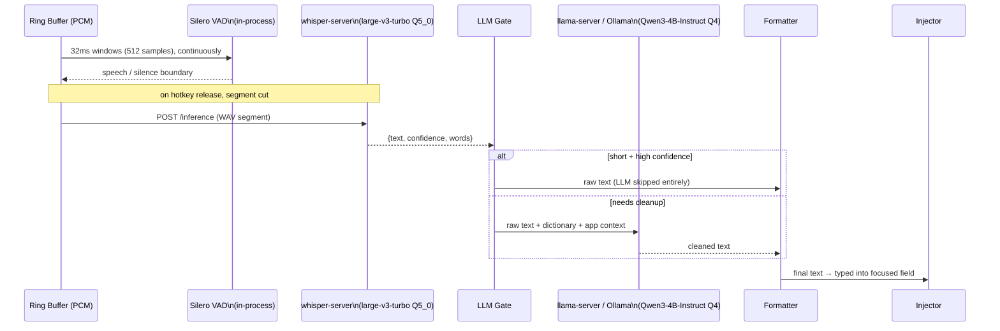

# mockingbird — models

> **Status:** v1 design, pre-code — reflects the model choices fixed in
> [ARCHITECTURE.md §3](./ARCHITECTURE.md#3-technology-stack) and
> [§6](./ARCHITECTURE.md#6-the-dictation-pipeline).
> **Owner:** bhattacharjeenirjhar26@gmail.com
> **Last updated:** 2026-09-16

Every model mockingbird runs, runs **on-device**, loaded from
`~/.mockingbird/models/` and served by a local subprocess bound to
`127.0.0.1` — never a hosted API. See
[SECURITY_PRIVACY.md §3](./SECURITY_PRIVACY.md#3-network-policy) for the
network guarantee this depends on. This doc is the inventory of *which*
models, *where* in the pipeline each one sits, and *how* it's invoked.

## Table of contents

1. [Model inventory](#1-model-inventory)
2. [Where each model sits in the pipeline](#2-where-each-model-sits-in-the-pipeline)
3. [Voice activity detection — Silero VAD](#3-voice-activity-detection--silero-vad)
4. [Speech-to-text — Whisper (whisper.cpp)](#4-speech-to-text--whisper-whispercpp)
5. [Cleanup / formatting LLM — Qwen3-4B-Instruct](#5-cleanup--formatting-llm--qwen3-4b-instruct)
6. [Vector search — sqlite-vec (not a model)](#6-vector-search--sqlite-vec-not-a-model)
7. [Model swapping & configuration](#7-model-swapping--configuration)
8. [Acquisition, storage & integrity](#8-acquisition-storage--integrity)
9. [Licensing](#9-licensing)

---

## 1. Model inventory

| Model | Role | Runs via | Runs as | Default size class |
|---|---|---|---|---|
| **Silero VAD** | Voice activity detection — decide when speech starts/stops in the audio stream | `onnxruntime-node` | native module, in-process | ~1–2 MB (ONNX) |
| **Whisper `large-v3-turbo`, Q5_0** | Speech-to-text (ASR) — audio → raw transcript | `whisper.cpp` (`whisper-server`) | subprocess, HTTP `:8771` | ~800 MB–1.5 GB quantized |
| **Qwen3-4B-Instruct, Q4** | Cleanup/formatting LLM — raw transcript → cleaned, punctuated, formatted text | Ollama **or** `llama-server` (llama.cpp) | subprocess, HTTP `:8772` | ~2.5–3 GB quantized |

Three models, three distinct jobs, three different runtimes — deliberately
not consolidated into one model, because VAD needs to be near-instant and
tiny, ASR needs to be accurate on raw audio, and the cleanup LLM needs
instruction-following on already-transcribed text, and no single model in
this size range is best at all three.

## 2. Where each model sits in the pipeline

This mirrors [ARCHITECTURE.md §6](./ARCHITECTURE.md#6-the-dictation-pipeline)
exactly — see that section for the full FSM context around it. The one
routing decision worth calling out here: **the LLM is conditionally skipped**
by the LLM Gate for short, high-confidence utterances, so a quick "yes" or
"ok" never pays LLM latency it doesn't need. VAD and ASR are never skipped —
every captured segment goes through both.

## 3. Voice activity detection — Silero VAD

- **Job:** classify 32ms audio windows (512 samples at 16kHz, the size
  Silero v5 requires, with the previous window's last 64 samples prepended
  as context) as speech/silence in real time, while
  the ring buffer is filling, to find utterance boundaries (and to detect
  700ms of silence as the auto-chunk boundary in `CAPTURE_LOCK` mode — see
  [ARCHITECTURE.md §5](./ARCHITECTURE.md#5-the-hotkey-state-machine)).
- **Where it's used:** continuously, in-process, on the always-running ring
  buffer — this is the only model that runs even when the hotkey isn't
  pressed (it's how the ring buffer knows what "speech" looks like for
  pre-roll purposes).
- **How it's invoked:** loaded once at daemon startup via
  `onnxruntime-node`, called synchronously per-frame from the `SEG` stage in
  [the system architecture diagram](./ARCHITECTURE.md#4-system-architecture).
  No HTTP hop — it's a native module call in the same process.
- **Why this model:** small enough to run per-frame with negligible CPU
  cost, purpose-built for VAD (not a general audio model repurposed for it),
  and ships as ONNX so it loads through the same `onnxruntime-node`
  dependency without needing a second inference runtime.

## 4. Speech-to-text — Whisper (whisper.cpp)

- **Job:** convert a cut audio segment (PCM, 16kHz) into a raw text
  transcript, plus a `confidence` score (mean probability of the spoken,
  non-punctuation words) used by the LLM Gate's skip decision.
- **Where it's used:** once per finalized utterance — triggered when the
  hotkey is released (`CAPTURE_PTT`) or a silence boundary is hit in lock
  mode (`CAPTURE_LOCK`). Never runs continuously; only on a cut segment.
- **How it's invoked:** `whisper-server`, a supervised child process running
  `whisper.cpp`, listening on `127.0.0.1:8771`. The daemon `POST`s the
  segment as a WAV upload to `/inference` (`response_format=verbose_json`)
  and gets back `{text, confidence, words}`. First start on a machine takes
  ~15s while Metal compiles its shaders (cached afterwards), which is why it
  runs as a long-lived child rather than per dictation. If
  `whisper-server` dies, the supervisor restarts it — dictation queues or
  degrades rather than silently failing, per the "degrade, don't break"
  principle in [ARCHITECTURE.md §2](./ARCHITECTURE.md#2-core-principles).
- **Model file:** `large-v3-turbo`, quantized to `Q8_0` (874 MB), shipped by
  `scripts/install.sh` and the default in `apps/daemon/src/runtime.ts`. It is
  multilingual, which is what makes it hold up on accented English where the
  English-only models drop words; requests pin `language=en` so it doesn't
  drift to another language.
- **Measured on an M3 (warm server, 4.5s clip, median of 3 —
  `bun run bench:models`):** `base.en` 177ms, `small.en` Q5_1 533ms,
  `medium.en` Q5_0 1508ms, `large-v3-turbo` Q8_0 2142ms, `large-v3-turbo`
  Q5_0 2248ms. The encoder alone is ~1.1s of that on the GPU, and the
  Homebrew `whisper-cpp` has no Core ML encoder, which would cut it. Accuracy
  was chosen over speed here; `MOCKINGBIRD_ASR_MODEL` takes a file name in
  `models/` or a path, so a slower Mac can drop to `small.en`.
- **Q8_0 over Q5_0**, measured on a 57s recording of real speech: Q8_0 both
  reads better ("I just woke up, it's my birthday" where Q5_0 gave "with my
  birthday", "Fixed punctuation" where Q5_0 gave "Exponctuation") and runs
  slightly faster (4843ms vs 5007ms). The 300 MB is worth it.
- **Too little silence around the speech loses whole passages.** On that same
  recording, `large-v3-turbo` with 700ms of padding dropped a 20-second
  stretch from the middle (373 characters instead of 650); at 1500ms it
  transcribed all of it. Whisper decides per 30-second window whether a
  stretch is speech, and a tight cut pushes that decision the wrong way.
  `-nth` (no-speech threshold) and `-sns` made no difference — padding did.
  `large-v3` (non-turbo) never dropped it at any padding, but takes ~7s to
  turbo's ~3.8s on a 57s clip, and was no more accurate here.
- **How the audio is cut matters as much as the model.** On the same
  recording, cutting the silences out of the middle, or trimming tight to the
  speech, produced wrong words and capitals mid-sentence; keeping the
  silences and padding ~1s either side produced clean sentences. `trimToSpeech`
  does the latter — Whisper reads a sentence from the rhythm around it, not
  only from the words.
- The integration tests still use `base.en` (~148 MB), which keeps them
  quick; it is not what ships.

## 5. Cleanup / formatting LLM — Qwen3-4B-Instruct

- **When its output is rejected:** `acceptCleanup` falls back to the raw
  transcript when the cleaned text is far shorter than what went in (80% for
  text over 120 characters, 50% below that) or far longer, or when it looks
  like an answer rather than a rewrite.
- **When it runs:** only when the transcript needs it. `shouldSkipLlm`
  (`packages/llm/src/cleanup.ts`) skips cleanup for very short utterances, and
  for confident transcripts that carry no filler word and no stutter —
  `formatText` supplies the capital and the end punctuation without a model.
  Cleanup costs 400-1500ms, which is most of the wait after speaking.
- **Job:** take the raw ASR transcript plus context (user dictionary,
  frontmost-app profile) and produce the final text — punctuation,
  capitalization, disfluency removal ("um", false starts), per-app style
  (e.g. no auto-caps in Terminal), and voice-command interpretation.
- **Where it's used:** only when the LLM Gate decides cleanup is needed —
  short, high-confidence utterances skip straight from ASR to the Formatter.
  This is the one model in the pipeline that's *conditionally* invoked.
- **How it's invoked:** either Ollama or `llama-server` (llama.cpp),
  supervised subprocess, `127.0.0.1:8772`. The daemon sends the raw text
  plus the relevant slice of the `dictionary` table and the current
  `app_profile` row (see [the SQLite schema](./ARCHITECTURE.md#7-where-sqlite-fits))
  as prompt context, and gets cleaned text back.
- **Model file:** `Qwen3-4B-Instruct`, quantized to `Q4`. Chosen as an
  instruction-tuned model small enough to run acceptably on a laptop GPU/CPU
  while still following formatting instructions reliably.
- **Fallback behavior:** if this server is down, dictation falls back to raw
  ASR output rather than blocking — same degrade-don't-break principle as
  `whisper-server`.

## 6. Vector search — sqlite-vec (not a model)

`sqlite-vec` (mentioned in [ARCHITECTURE.md §7](./ARCHITECTURE.md#7-where-sqlite-fits))
is a SQLite extension for storing and querying vector embeddings, loaded
directly into `data.db` via `db.loadExtension()` — **it is not itself a
model**, and no embedding model is chosen yet. Semantic search over
utterance history and dictionary terms is listed as v1.x/optional scope; if
built, it will need its own embedding model entry in this doc (likely a
small local sentence-embedding model, on-device for the same reasons as
everything else in this file). Tracked as undecided, not silently assumed.

## 7. Model swapping & configuration

- **ASR and LLM are both swappable via config** — per
  [ARCHITECTURE.md §3](./ARCHITECTURE.md#3-technology-stack), the `asr` and
  `llm` packages are designed so the base URL and model name are
  configuration, not hardcoded, specifically so a different model size (or,
  per [ARCHITECTURE.md §13](./ARCHITECTURE.md#13-is-docker-needed), a
  `llama-server` running on a separate machine on the LAN) can be substituted
  without a code change.
- **VAD is not currently designed as swappable** — Silero via
  `onnxruntime-node` is treated as a fixed part of the pipeline, not a
  configurable choice, since its cost/accuracy profile isn't a tradeoff most
  users need to tune.
- Model choice (which Whisper size, which LLM) is expected to live in the
  `settings` table (see [state ownership map](./ARCHITECTURE.md#8-state-ownership-map))
  and be editable via the TUI or a future `mockingbird config` CLI — exact
  surface undecided, see [ARCHITECTURE.md §16](./ARCHITECTURE.md#16-known-gaps--scope-not-yet-decided).

## 8. Acquisition, storage & integrity

- Model weights are **never bundled** in the release archive — too large.
  They're fetched on demand via `mockingbird models pull <name>`, the
  **one and only** network call anywhere in the system, and always
  user-triggered and URL-transparent (see
  [SECURITY_PRIVACY.md §3](./SECURITY_PRIVACY.md#3-network-policy)).
- Downloaded weights land in `~/.mockingbird/models/` as flat files —
  filesystem-owned, no database record beyond whatever `settings` entry
  points at the active model name/path.
- **Integrity is not yet verified on download.** Per
  [SECURITY_PRIVACY.md §6](./SECURITY_PRIVACY.md#6-process--trust-boundaries),
  a model file is untrusted input to native C/C++ parsers
  (`whisper.cpp`, `onnxruntime-node`), so checksum/signature verification
  against the source repo's published hash before first load is an open
  hardening item, not yet implemented.

## 9. Licensing

mockingbird's own code is [MIT](../LICENSE). The models and the tools that
run them have their own licenses, which need checking before shipping an
archive that contains them
([ARCHITECTURE.md §16](./ARCHITECTURE.md#16-known-gaps--scope-not-yet-decided)):

| Component | License (verify before release) |
|---|---|
| `whisper.cpp` | MIT |
| `llama.cpp` | MIT |
| Ollama | MIT (Apache-2.0 dependencies included — verify at release time) |
| Silero VAD weights | check upstream model card |
| Whisper `large-v3-turbo` weights | check upstream model card (OpenAI Whisper weights, MIT code / separate weight terms) |
| Qwen3 weights | check upstream model card (Qwen license terms, not plain MIT) |

Model **weights** and the **code that runs them** often carry different
licenses — this table should be double-checked at release time, not assumed
from the inference engine's license.
