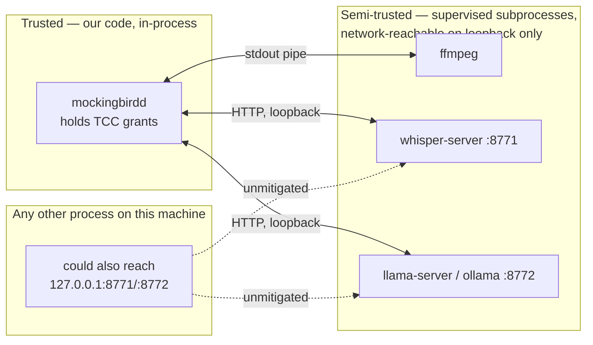

# mockingbird — security & privacy

> **Status:** v1 design, pre-code — this document describes the policies the
> architecture in [ARCHITECTURE.md](./ARCHITECTURE.md) is committed to, plus
> the privacy risks that remain even when those policies hold. Where
> something is a guarantee we intend to enforce mechanically, it says so.
> Where it's a known open risk, it says that instead — this file is not
> marketing copy.
> **Owner:** bhattacharjeenirjhar26@gmail.com
> **Last updated:** 2026-09-16

Everything mockingbird does is built around one sentence: **your voice and
your keystrokes never leave your machine.** This document exists to make that
claim checkable rather than trusted on faith, and to be honest about the
privacy exposure that local-first design does *not* eliminate — a tool that
listens to your microphone and types into every app you use has a large blast
radius even with zero network calls.

## Table of contents

1. [Threat model — what this defends against, and what it doesn't](#1-threat-model--what-this-defends-against-and-what-it-doesnt)
2. [Data inventory — what mockingbird actually touches](#2-data-inventory--what-mockingbird-actually-touches)
3. [Network policy](#3-network-policy)
4. [macOS permissions (TCC)](#4-macos-permissions-tcc)
5. [At-rest storage & retention](#5-at-rest-storage--retention)
6. [Process & trust boundaries](#6-process--trust-boundaries)
7. [Supply chain & install integrity](#7-supply-chain--install-integrity)
8. [Known privacy issues — open, unresolved](#8-known-privacy-issues--open-unresolved)
9. [Hardening roadmap](#9-hardening-roadmap)
10. [Reporting a vulnerability](#10-reporting-a-vulnerability)

---

## 1. Threat model — what this defends against, and what it doesn't

**In scope — this design defends against:**

- A remote party (the vendor, a cloud API, an analytics SDK) ever observing
  your audio, your dictated text, or the fact that you use mockingbird at
  all, during normal operation.
- Network-based interception of dictation content — there is no dictation
  traffic on any network, local or remote, to intercept.
- Silent background exfiltration introduced by a dependency — enforced by
  the "no dependency we didn't compile ourselves speaks HTTP outward" rule
  in [§3](#3-network-policy).

**Explicitly out of scope — this design does not defend against:**

- **A local attacker with code execution as your user**, or physical access
  to an unlocked/unencrypted Mac. Anyone who can run code as you can read
  `~/.mockingbird/data.db` directly; mockingbird does not add a second lock
  on top of your OS account.
- **Malware already on the machine.** whisper-server and llama-server bind
  to `127.0.0.1`, but *any other local process* — including malware running
  as the same user — can also reach `127.0.0.1:8771`/`:8772`. Loopback
  binding stops the network; it does not stop your own machine from talking
  to itself.
- **A compromised daemon.** Because mockingbirdd holds Accessibility/Input
  Monitoring grants (see [§4](#4-macos-permissions-tcc)), a supply-chain
  compromise of the daemon binary itself would have near-total control:
  global keylogging and arbitrary keystroke injection into any app. This is
  the single highest-value target in the system, which is why
  [§7](#7-supply-chain--install-integrity) treats build/release integrity as
  a security control, not paperwork.
- **Root-level or kernel-level compromise, or a malicious OS update.**
  Outside any userland tool's control.

If a threat isn't in the first list, treat it as present and unmitigated
until it's explicitly closed.

## 2. Data inventory — what mockingbird actually touches

| Data | Sensitivity | Where it lives | Persisted? |
|---|---|---|---|
| Live microphone audio | High — raw voice | Ring buffer, daemon memory | No (RAM only, 30s window, overwritten continuously) |
| Captured utterance audio | High | Passed to `whisper-server` over loopback HTTP | Not persisted **unless** the user opts in to `audio_path` retention (off by default) |
| Raw ASR transcript | High — often as sensitive as the audio itself | `bun:sqlite`, `utterance.raw_text` | **Yes**, indefinitely, no expiry by default |
| Final (LLM-cleaned) transcript | High | `bun:sqlite`, `utterance.final_text`, plus `utterance_fts` | **Yes**, indefinitely |
| Which app you dictated into | Medium — behavioral/usage signal | `utterance.app_bundle` | Yes |
| Per-stage latency timings | Low | `utterance.t_*` columns | Yes |
| User dictionary (names, jargon, codenames) | Medium–High — can include proper nouns like client/project names | `dictionary` table | Yes |
| Correction history (what got edited after the fact) | Medium–High — can reconstruct sensitive corrections | `correction` table | Yes |
| Settings (hotkey binding, model choice) | Low | `settings` table | Yes |
| ASR/LLM model weights | None (public model files) | `~/.mockingbird/models/` | Yes, on disk |
| Logs | Variable — see [§8](#8-known-privacy-issues--open-unresolved) | `~/.mockingbird/logs/` | Yes, rotated |

The two lines that matter most: **raw and final transcripts persist to an
unencrypted SQLite file by default, forever**, and **audio is the one thing
that does *not* persist by default.** Anyone reasoning about "what could leak
from this machine" should start from that table, not from the network story.

## 3. Network policy

This is the part of the design that's easiest to make into a hard,
mechanical guarantee, per [ARCHITECTURE.md §9](./ARCHITECTURE.md#9-everything-is-local):

- **No cloud ASR, no cloud LLM.** Both run on-device, bound to `127.0.0.1`.
- **No telemetry, no analytics, no crash reporting.** If opt-in anonymous
  usage stats are ever added, they must be default-off, behind an explicit
  separate toggle — never folded into a general onboarding "accept".
- **No account, login, or license server** — nothing to phone home to in the
  first place.
- **The only network call in the entire system is model download**
  (`mockingbird models pull <name>`), and it must always: be user-triggered,
  print the exact URL being fetched (Hugging Face / ggml repos), and never
  run silently in the background (this rules out silent auto-update checks
  too — see [§16 of ARCHITECTURE.md](./ARCHITECTURE.md#16-known-gaps--scope-not-yet-decided)).
- **The stack rule in [ARCHITECTURE.md §3](./ARCHITECTURE.md#3-technology-stack)
  is itself a security control**: every dependency is either code we wrote
  (auditable) or a binary we `fetch()`/`spawn()`/load as a prebuilt module
  (opaque, but sandboxed to loopback-only HTTP or in-process calls we
  control the arguments to) — never source we compile from a language we
  can't easily audit ourselves.
- **Enforced, not just claimed:** the release binary should request no
  outbound network entitlement beyond the explicit model-download path.
  `lsof -i` while dictating should show nothing outbound. This should
  eventually be a CI check (e.g. a network-namespace or `sandbox-exec`
  smoke test that asserts the daemon makes zero non-loopback connections
  during a scripted dictation run), not just a doc claim — tracked in
  [§9](#9-hardening-roadmap).

## 4. macOS permissions (TCC)

mockingbird needs three TCC grants to function, and it's worth being blunt
about what each one actually means:

| Permission | Why it's needed | What it *also* grants |
|---|---|---|
| **Microphone** | Capture audio for dictation | Nothing beyond mic access — the narrowest of the three |
| **Accessibility** | Type dictated text into the focused app (`CGEventPost`), and read the one character before the cursor there, to decide on a space | Broad UI automation: the ability to synthesize any input into any app |
| **Input Monitoring** | Global hotkey detection (CoreGraphics event tap via `bun:ffi`) | **System-wide keystroke observation** — the same class of access a keylogger needs |
| macOS grants storage (which apps hold which TCC grants) | — | Lives in Apple's TCC database, **not** ours — see [state ownership map, ARCHITECTURE.md §8](./ARCHITECTURE.md#8-state-ownership-map) |

Input Monitoring in particular means the daemon *could* technically log every
keystroke on the system, not just what it types itself. mockingbird's design
intent is that it only ever acts on the hotkey and never records or persists
other keystrokes — but this is a code-review and audit obligation, not
something the OS permission model itself prevents. Anyone auditing this
project for trust should start at `packages/hotkey/src/event-tap.ts`, the most
security-sensitive file in the repo. As implemented today, that file:

- creates the tap with `kCGEventTapOptionListenOnly`, so events are observed
  and never modified or swallowed;
- **discards every keystroke except Fn and Esc inside the tap callback**, so
  no other keycode is ever passed on, stored, or logged — the filter is three
  lines in one function, and deliberately easy to verify;
- never records typed characters, only key identity and timing.

Typing into other apps (Accessibility) is the mirror image of that risk, and
lives in `packages/inject/src/typing.ts`. As implemented today it:

- types text as Unicode key events, so the **clipboard is never read or
  written** — nothing of yours is clobbered, and dictation doesn't end up in
  clipboard-history tools;
- **removes line breaks before typing** (they become spaces), so dictated text
  can't press Return for you: it can't send a half-finished message or run a
  command in a terminal;
- strips other control codes, which could otherwise do stranger things to a
  terminal;
- types only what the pipeline produced, into whichever app you had in front;
- reads **one character** of what's already in that app: the one just before
  the cursor (or before the selection), so a new sentence gets a space after
  the last one. `packages/context/src/caret.ts` asks for exactly that range
  through Accessibility (`AXStringForRange`, length 1), never the field's
  whole value. The character decides one space and is dropped; it's never
  logged, stored, or sent to the models, and `mockingbird type --check` reports
  only whether it could be read. Terminals are skipped, and so is any field
  that doesn't answer within 250ms;
- **stops mid-text when focus leaves the app you dictated into**: typing asks a
  guard before every chunk, and `apps/daemon/src/session.ts` answers it by
  polling the frontmost app throughout. So a long dictation — hundreds of key
  events, with pauses — can't follow you into a chat window or a password
  field. What didn't get through is reported as undelivered, never as typed.

Both grants are checked before use (`CGPreflightPostEventAccess`,
`IOHIDCheckAccess`) rather than assumed, and mockingbird degrades to printing
in the terminal when they're missing.

Because these grants are broad, macOS's own permission prompts are the
user's real control surface — mockingbird should never try to work around a
denied grant (e.g. no fallback keylogging technique if Input Monitoring is
refused; dictation should simply not function until granted).

### The grants land on different programs depending on how you run it

TCC records a grant against the **responsible process**, not the file that
called the API. For a command run from a terminal, responsibility resolves up
to the terminal app — which is why `mockingbird listen` uses Ghostty's or
Terminal's grants. Under launchd there is no such parent, so the agent's own
executable becomes responsible.

`mockingbird start` therefore does not run the agent as `bun`. It installs
**`~/.mockingbird/bin/mockingbird`** — a copy of the Bun binary, re-signed
ad-hoc under the identifier `mockingbird` — and points the LaunchAgent at
that. The grants land on it, and three things follow:

- **`bun` itself needs no permission.** Had the agent run as
  `/opt/homebrew/bin/bun`, Accessibility and Input Monitoring on that binary
  would extend to *every* bun script for which bun is the responsible process:
  each one able to synthesize input into any app and observe every keystroke,
  with no way to scope the grant to mockingbird or revoke it for one script
  alone. A separately-named copy is a separate TCC client, so that does not
  happen. Anyone upgrading from an earlier build should remove `bun` from both
  Privacy lists.
- **The grants survive upgrades and edits.** TCC keys an unbundled client by
  resolved path plus, absent a signing identity, its cdhash. Our copy changes
  on neither `brew upgrade bun` (it is ours, not Homebrew's) nor a `git pull`
  (it is the runtime, not our TypeScript). `mockingbird start` re-copies only
  when the installed bun has actually changed, and says so, because that is
  the one moment the grants need redoing.
- **The checkout becomes security-critical.** The binary executes
  `apps/daemon/src/agent.ts` from wherever mockingbird was installed, and it
  holds Accessibility. Anyone who can write to that directory, or to
  `~/.mockingbird/bin/`, can type into any app as you and watch your
  keystrokes. `bin/` is created `0700` and the plist `0600`, but the checkout
  is on the user's own filesystem and this is worth stating plainly rather
  than implying `0700` settles it.

Compiling a genuine single binary (ARCHITECTURE §11) would be cleaner still,
and was tried: `bun build --compile` embeds the `onnxruntime-node` addon but
not the `libonnxruntime.1.dylib` it links against, so VAD fails to load at
runtime. It also re-signs on every build, which would drop the grants each
time. Both are tracked in [§9](#9-hardening-roadmap).

## 5. At-rest storage & retention

- **Location:** everything lives under `~/.mockingbird/` — `data.db`,
  `models/`, `bin/`, `logs/`, the Unix socket, and PID file. See the
  [repository/state layout](./ARCHITECTURE.md#10-repository-layout) and
  [state ownership map](./ARCHITECTURE.md#8-state-ownership-map).
- **No encryption at rest, by default, in v1.** `bun:sqlite` stores
  `data.db` as a plain SQLite file. Anyone with filesystem read access to
  your user account — another local process running as you, a stolen
  unencrypted laptop, a misconfigured backup — can open it with any SQLite
  client and read your full dictation history in plaintext. This is the
  single biggest gap between "no data leaves your machine" and "your data is
  actually protected," and it's tracked as the top item in
  [§9](#9-hardening-roadmap).
- **Audio retention is opt-in and off by default.** The `audio_path` column
  on `utterance` is nullable; nothing is written unless the user explicitly
  turns on retention (for debugging or building their own dictionary
  training set). This is the one piece of the inventory in
  [§2](#2-data-inventory--what-mockingbird-actually-touches) that defaults
  to *not* persisting.
- **The Unix socket is `0600`**, not a TCP port — only your own user account
  can connect to it, and it's deleted on clean daemon shutdown.
- **Diagnostics export** (`mockingbird diagnostics export`, still
  undesigned — see [ARCHITECTURE.md known gaps](./ARCHITECTURE.md#16-known-gaps--scope-not-yet-decided))
  must bundle logs and config only. Audio and transcripts must never be
  included unless the user opts in *per export* — this is a hard requirement
  for that command's design, not a nice-to-have, since the natural failure
  mode of a "just attach everything" diagnostics bundle is pasting someone's
  dictation history into a public GitHub issue.
- **Logs can leak transcript content if the daemon ever logs raw pipeline
  data for debugging.** This needs an explicit rule once logging is
  implemented: log stage timings, error codes, and model names freely; never
  log `raw_text`/`final_text` content at any log level above an explicitly
  opt-in "verbose debug" mode that warns the user before enabling it.
- **As implemented, the background agent's log holds no transcript.**
  `mockingbird start` points launchd's `StandardOutPath`/`StandardErrorPath`
  at `~/.mockingbird/logs/agent.log` (directory `0700`, plist `0600`). It
  records start-up, engine and permission state, errors, and the *character
  count* of each utterance with where it was delivered — never the words. The
  opt-in escape hatch named above is `MOCKINGBIRD_LOG_TEXT=1`, which adds the
  text and is off by default. The agent truncates the file at 1 MB on start,
  because launchd appends to it forever and never rotates it.

## 6. Process & trust boundaries

- The daemon is the only process holding TCC grants; the ASR/LLM servers
  never touch the microphone, Accessibility, or Input Monitoring APIs
  directly.
- Loopback binding keeps `whisper-server`/`llama-server` off the network,
  but **does not** isolate them from other local processes — see
  [§1](#1-threat-model--what-this-defends-against-and-what-it-doesnt). If
  this needs closing, the options are a shared-secret header on loopback
  requests or a Unix-socket transport for these servers too, matching the
  IPC socket's model — not yet decided, tracked in
  [§9](#9-hardening-roadmap).
- **Model files are untrusted input to native code.** A GGUF or ONNX file is
  parsed by `whisper.cpp`/`onnxruntime-node`, both written in C/C++ — a
  malicious or corrupted model file is a plausible memory-corruption vector.
  This is why model downloads should eventually verify a checksum/signature
  against the source repo's published hash before loading, not just fetch
  and run.

## 7. Supply chain & install integrity

- **Release binaries are checksummed** (`checksums.txt`, sha256) per
  [ARCHITECTURE.md §12](./ARCHITECTURE.md#12-deployment--distribution), but
  the `curl -fsSL install.sh | sh` path is only as trustworthy as the
  install script verifying that checksum *before* execution — this must be
  a hard requirement of that script, not an afterthought.
- **The current source installer** (`scripts/install.sh`, run from `main`
  before any release exists) trusts GitHub and this repo, the same way
  `git clone` does: it clones `main`, so pinning the script alone would add
  nothing, and a checksum published in this repo can't catch a compromise of
  this repo. Everything it fetches from elsewhere is verified: tools come from
  Homebrew (sha256 per formula) and the models are pinned and sha256-checked.
  Once releases exist, the one-line install should move to a tagged release
  and verify `checksums.txt` as above.
- **Bundled third-party binaries** (ffmpeg, whisper-server) ship inside the
  release archive. Their provenance (which upstream build, which commit,
  which signature if any) should be recorded in the release process so a
  compromise upstream is traceable.
- **The Homebrew tap PR is reviewed and merged by a human**, not
  auto-merged — this is a deliberate supply-chain control per
  [ARCHITECTURE.md §14](./ARCHITECTURE.md#14-cicd-pipeline) and should stay
  that way even once the release process is trusted.
- **Auto-update, if it ships, must stay opt-in / explicit-confirm** — a
  silent background updater is both a "local-first" violation (unannounced
  network activity) and a supply-chain risk multiplier (a compromised update
  channel becomes a silent, automatic compromise of the daemon).

## 8. Known privacy issues — open, unresolved

These are real gaps as currently designed, not hypothetical edge cases. None
of them are mitigated by "no network calls":

1. **Backup exposure.** Time Machine, iCloud Desktop/Documents sync (if
   `~/.mockingbird` were ever under a synced folder — it isn't by default,
   but nothing currently prevents a user from relocating it), and any
   third-party backup tool will happily back up an unencrypted, complete
   dictation history in `data.db`. No `.gitignore`-equivalent exclusion
   guidance exists yet for backup tools.
2. **No data export or deletion UI in v1.** History and dictionary data
   accumulate indefinitely in SQLite with no built-in "delete my history,"
   "delete this utterance," or "export and wipe" flow. A user who dictates
   something sensitive by mistake currently has no in-product way to remove
   it short of directly editing the SQLite file.
3. **Swap/pagefile.** The "audio never touches disk" guarantee in
   [ARCHITECTURE.md §9](./ARCHITECTURE.md#9-everything-is-local) is about
   deliberate persistence, not physical memory. Under memory pressure, macOS
   can page process memory — including the ring buffer and in-flight
   transcript text — to disk via swap, which is encrypted at rest only if
   FileVault is enabled. This is an OS-level caveat worth stating explicitly
   rather than letting "never touches disk" be read as an absolute.
4. **Model-download metadata leak.** The one legitimate network call
   (`mockingbird models pull`) necessarily tells Hugging Face / the model
   host which model you're fetching, from your IP, at that timestamp. This
   is disclosed and user-triggered, not hidden — but it is still information
   about you leaving the machine, and should be named as such rather than
   folded into "no network calls."
5. **Correction/dictionary data can be more sensitive than it looks.**
   `dictionary` and `correction` are designed to hold proper nouns and
   learned edits — which in practice means client names, project codenames,
   or personal names end up persisted in a structured, searchable table
   without the user necessarily thinking of "adding a word" as "storing a
   record."
6. **Multi-user / shared Mac accounts.** File permissions on `~/.mockingbird`
   default to whatever the OS gives a new directory under the user's home —
   worth an explicit `chmod` to `0700` at setup time rather than relying on
   umask defaults, especially since this directory holds the SQLite history.
7. **FTS5 full-text search widens the blast radius of a single leak.** Once
   `utterance_fts` exists, a single unauthorized read of `data.db` is not
   just "dump the file" — it's instantly searchable, which matters if this
   file is ever attached to a bug report, shared for debugging, or copied
   during troubleshooting.

## 9. Hardening roadmap

Rough priority order, highest-impact first — none of this is scheduled yet,
this is a "if solving one of these, start here" list:

1. **Ship a genuinely compiled, stably-signed binary.** Two blockers, both
   measured: `bun build --compile` doesn't carry `libonnxruntime.1.dylib`
   alongside the embedded addon, and an ad-hoc signature changes on every
   build, dropping the TCC grants. A self-signed certificate held in the
   keychain fixes the second (the designated requirement keys on the
   certificate, not the cdhash); the first needs the dylib shipped beside the
   binary or VAD moved off `onnxruntime-node`. Until then the re-signed copy
   in [§4](#4-macos-permissions-tcc) carries the grants, and the checkout it
   runs is part of the trusted computing base.
2. **Encrypt `data.db` at rest**, or at minimum document and default to
   `0600`/`0700` permissions on `~/.mockingbird` and its contents at setup
   time, and evaluate SQLCipher or app-level column encryption for
   `raw_text`/`final_text`.
3. **Ship a real delete/export story** before v1 GA: `mockingbird history
   clear`, per-utterance delete from the TUI, and a documented retention
   policy (even if the policy is "kept forever unless you delete it" — say
   so explicitly in-product, not just in this doc).
4. **CI network-isolation smoke test** that fails the build if the compiled
   daemon makes any non-loopback connection during a scripted dictation run
   — turns [§3](#3-network-policy) from a claim into an enforced gate,
   mirroring how `ci.yml` already gates typecheck/lint/tests per
   [ARCHITECTURE.md §14](./ARCHITECTURE.md#14-cicd-pipeline).
5. **Logging policy enforced in code review**: no transcript content above
   opt-in verbose-debug logging, checked as part of the review checklist for
   any PR touching `packages/asr`, `packages/llm`, or the daemon's logger.
6. **Checksum/signature verification on downloaded model weights**, before
   they're loaded by native parsers.
7. **Loopback-service authentication** for `whisper-server`/`llama-server`
   (shared secret or move to Unix sockets) to close the "any local process
   can query them" gap in [§1](#1-threat-model--what-this-defends-against-and-what-it-doesnt).
8. **Backup-tool exclusion guidance** (e.g. a documented Time Machine
   exclusion, or a `com.apple.metadata:com_apple_backup_excludeItem`
   extended attribute set at setup time) if `data.db` is to stay
   unencrypted.
9. **GitHub's private vulnerability reporting**, enabled via the repo's
   Security settings so `SECURITY.md`'s reporting flow is backed by
   Advisories rather than a plain email thread — see
   [§10](#10-reporting-a-vulnerability).

## 10. Reporting a vulnerability

The project is on GitHub at
[github.com/NirjharBhattacharjee/mockingbird](https://github.com/NirjharBhattacharjee/mockingbird),
and the root-level [`SECURITY.md`](../SECURITY.md) is the canonical
reporting entry point — **do not open a public issue for a vulnerability.**
In short: report privately to bhattacharjeenirjhar26@gmail.com, or via
GitHub's private vulnerability reporting once it's enabled on the repo (see
[§9](#9-hardening-roadmap), item 8, still open).

This document should move out of "pre-code" status and start being checked
against real code (permissions actually requested, what actually gets
logged, whether the CI network-isolation test in
[§9](#9-hardening-roadmap) exists) as soon as `apps/daemon` has its first
commit — per the same rule [ARCHITECTURE.md §17](./ARCHITECTURE.md#17-versioning--how-this-doc-evolves)
applies to itself: if reality diverges from this doc, the doc is wrong and
gets fixed in the same PR.
