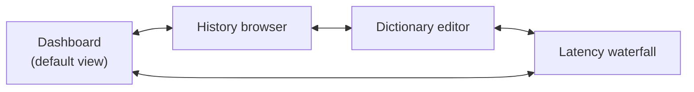

# mockingbird — terminal UI

> **Status:** v1 design, pre-code — elaborates the `mockingbird-tui`
> component named in
> [ARCHITECTURE.md §4](./ARCHITECTURE.md#4-system-architecture) and scoped
> in [ARCHITECTURE.md §15](./ARCHITECTURE.md#15-v1-scope) ("OpenTUI
> dashboard: live state, latency waterfall, history browser, dictionary
> editor"). This doc covers the theme and the screen/feature breakdown that
> section only names in passing.
> **Owner:** bhattacharjeenirjhar26@gmail.com
> **Last updated:** 2026-09-16

mockingbird has **no GUI app, no menubar icon, no floating HUD** — per
[ARCHITECTURE.md §2](./ARCHITECTURE.md#2-core-principles), point 2, feedback
during dictation itself is audio cues only. The TUI (`mockingbird-tui`,
built on `@opentui/react`) is the *only* visual surface in the entire
system: a dashboard, a searchable history browser, a dictionary editor, and
a latency waterfall — nothing more, nothing that requires a window manager.

## Table of contents

1. [What the TUI is, structurally](#1-what-the-tui-is-structurally)
2. [Why Catppuccin](#2-why-catppuccin)
3. [Palette & flavors](#3-palette--flavors)
4. [Semantic color mapping](#4-semantic-color-mapping)
5. [Screens & what each one controls](#5-screens--what-each-one-controls)
6. [Navigation model](#6-navigation-model)
7. [What the TUI does *not* control](#7-what-the-tui-does-not-control)
8. [Accessibility](#8-accessibility)
9. [Open design decisions](#9-open-design-decisions)

---

## 1. What the TUI is, structurally

Per the [state ownership map](./ARCHITECTURE.md#8-state-ownership-map) and
[system architecture diagram](./ARCHITECTURE.md#4-system-architecture): the
TUI is a **separate, optional Bun process** that attaches to the daemon over
a Unix socket (NDJSON protocol) for live state, and reads `data.db`
**directly, read-only**, for history/dictionary browsing (WAL mode makes
this safe concurrently with the daemon writing — see
[DATABASE.md §12](./DATABASE.md#12-wal-mode--concurrency)). It holds no
source of truth of its own beyond tiny local view-state (scroll position,
active tab) that doesn't need to survive a restart.

Practically: you can quit the TUI entirely and dictation keeps working
unaffected — the daemon never depends on it being open. This is the same
"headless-testable core" principle from
[ARCHITECTURE.md §2](./ARCHITECTURE.md#2-core-principles) applied to the
UI layer specifically.

## 2. Why Catppuccin

[Catppuccin](https://catppuccin.com) is a community-maintained, open-source
pastel palette used across a huge range of terminal tools, editors, and
TUIs — soothing rather than harsh, with four flavors covering both light
and dark, and ports for essentially every framework mockingbird might touch
(terminal color libraries included). Picking it isn't arbitrary:

- **It's consistent with what this project already believes.** Per
  [PHILOSOPHY.md](./PHILOSOPHY.md), mockingbird exists partly to give back
  to the open-source community that made it possible — theming the one
  visual surface in the app with a beloved open-source community palette,
  rather than a proprietary or one-off custom scheme, is a small but genuine
  extension of that.
- **A user who lives in a terminal likely already has Catppuccin
  installed** somewhere in their stack (Neovim, tmux, Alacritty, Starship,
  ...) — reusing it means mockingbird's TUI feels native to that setup
  instead of clashing with it.
- **It ships both light and dark flavors from one coherent design**, which
  matters for a tool that should work equally well in a light or dark
  terminal — see [§3](#3-palette--flavors).

**Verify hex values against the canonical palette** (the `catppuccin/catppuccin`
project on GitHub) at implementation time — the values in [§3](#3-palette--flavors)
below are transcribed from memory of the well-known palette and should be
checked against the source before being hardcoded into a theme file.

## 3. Palette & flavors

Catppuccin ships four flavors, darkest to lightest: **Mocha → Macchiato →
Frappé → Latte**. Each defines the same set of ~26 named colors, just tuned
per flavor — a component styled with the token `mauve` looks right in every
flavor without per-flavor special-casing.

- **Default: Mocha** (dark) — matches the primary user (a developer, likely
  already in a dark terminal, per
  [ARCHITECTURE.md §12](./ARCHITECTURE.md#12-deployment--distribution)'s
  Homebrew-first, developer-focused distribution).
  [ARCHITECTURE.md §16](./ARCHITECTURE.md#16-known-gaps--scope-not-yet-decided)'s
  config-surface gap is where flavor selection (auto light/dark detection
  vs. a manual `settings` entry — see
  [DATABASE.md §8](./DATABASE.md#8-settings)) gets resolved; not decided yet.
- **Light terminal users get Latte.** Whether this is auto-detected (some
  terminals expose background luminance; OpenTUI's own capability here is
  unconfirmed) or a manual toggle is one of the open decisions in
  [§9](#9-open-design-decisions).
- **Macchiato/Frappé** are available as explicit user choices even though
  neither is the default — no reason to hide them if `settings` already
  stores a flavor key.

Base structural colors (background layering, darkest to lightest surface),
Mocha values shown:

| Token | Mocha hex | Role |
|---|---|---|
| `crust` | `#11111b` | Outermost background, rarely used directly |
| `mantle` | `#181825` | App background |
| `base` | `#1e1e2e` | Primary surface (panels, main content area) |
| `surface0` | `#313244` | Raised surface (cards, input fields) |
| `surface1` | `#45475a` | Borders, dividers |
| `surface2` | `#585b70` | Stronger borders, inactive icons |
| `overlay0`–`overlay2` | `#6c7086`–`#9399b2` | Placeholder text, disabled state |
| `subtext0`/`subtext1` | `#a6adc8` / `#bac2de` | Secondary text |
| `text` | `#cdd6f4` | Primary text |

Accent colors (used for semantic meaning, not decoration — see
[§4](#4-semantic-color-mapping)), Mocha values:

| Token | Mocha hex |
|---|---|
| `rosewater` | `#f5e0dc` |
| `flamingo` | `#f2cdcd` |
| `pink` | `#f5c2e7` |
| `mauve` | `#cba6f7` |
| `red` | `#f38ba8` |
| `maroon` | `#eba0ac` |
| `peach` | `#fab387` |
| `yellow` | `#f9e2af` |
| `green` | `#a6e3a1` |
| `teal` | `#94e2d5` |
| `sky` | `#89dceb` |
| `sapphire` | `#74c7ec` |
| `blue` | `#89b4fa` |
| `lavender` | `#b4befe` |

Latte (light flavor) inverts the structural ramp — `base` becomes a near-white
(`#eff1f5`), `text` becomes a dark slate (`#4c4f69`) — with the same 14
accent token *names* remapped to values with equivalent contrast against a
light background. Exact Latte hex values should be pulled from the
canonical source rather than this doc when the theme file is implemented.

## 4. Semantic color mapping

Colors are assigned by **role**, not hardcoded per-component, so a flavor
swap (or a future custom-theme option) only touches one mapping table:

| UI role | Token (Mocha) | Where it's used |
|---|---|---|
| Background layers | `crust` / `mantle` / `base` / `surface0-2` | App chrome, panels, cards — see [§3](#3-palette--flavors) |
| Primary text | `text` | Utterance text, labels |
| Secondary/muted text | `subtext0`, `overlay0` | Timestamps, hints, placeholder text |
| Brand / focus accent | `mauve` | Active tab, focused input border, selection |
| Success | `green` | "final text injected" confirmation, healthy child-process status |
| Warning | `yellow` | Degraded state (e.g. LLM down, falling back to raw ASR — see [ARCHITECTURE.md §2](./ARCHITECTURE.md#2-core-principles), point 5) |
| Error | `red` | Child process crashed and isn't recovering, DB write failure |
| Info | `sky` | Neutral status text, tooltips |
| Hotkey FSM state — `IDLE` | `overlay0` (dim) | Dashboard state indicator, see [ARCHITECTURE.md §5](./ARCHITECTURE.md#5-the-hotkey-state-machine) |
| Hotkey FSM state — `ARMED`/`TAP_WAIT` | `yellow` | transitional states |
| Hotkey FSM state — `CAPTURE_PTT`/`CAPTURE_LOCK` | `red` | actively recording — deliberately the most attention-grabbing color, since this is "your mic is live" |
| Hotkey FSM state — `FINALIZING` | `sky` | processing |
| Latency waterfall — VAD stage | `teal` | per-stage bar in the waterfall, see [§5](#5-screens--what-each-one-controls) |
| Latency waterfall — ASR stage | `blue` | |
| Latency waterfall — LLM stage | `mauve` | |
| Latency waterfall — Inject stage | `pink` | |
| Diff view — removed (raw→final) | `red`, strikethrough | history browser's raw-vs-cleaned diff |
| Diff view — added (raw→final) | `green` | |

The FSM-state and latency-stage colors are picked to also be usable as
*shapes/labels* in a monochrome terminal (see [§8](#8-accessibility)) — the
color is reinforcement, never the only signal.

## 5. Screens & what each one controls

Four screens, matching
[ARCHITECTURE.md §15](./ARCHITECTURE.md#15-v1-scope) exactly — nothing
added beyond what's already scoped there:

### Dashboard (default view)
- **Live hotkey FSM state** ([ARCHITECTURE.md §5](./ARCHITECTURE.md#5-the-hotkey-state-machine)),
  streamed over the IPC socket, colored per [§4](#4-semantic-color-mapping).
- **Frontmost app** (from the Context Poller's cached lookup) — shows which
  app a dictation would currently target.
- **Child process health** — ffmpeg / whisper-server / llama-server, each
  as a status dot (`green` running, `yellow` restarting, `red` down) fed by
  the daemon's supervisor.
- **Most recent utterance**, live-updated the instant the "final" IPC event
  fires ([ARCHITECTURE.md §6](./ARCHITECTURE.md#6-the-dictation-pipeline)).
- This is the only screen driven primarily by the **IPC socket** rather than
  direct SQLite reads — it's showing in-memory daemon state
  ([state ownership map](./ARCHITECTURE.md#8-state-ownership-map)) that
  isn't persisted.

### History browser
- Lists `utterance` rows, most recent first
  (`idx_utterance_created_at`, [DATABASE.md §10](./DATABASE.md#10-indexes)).
- **Full-text search** over `final_text` via `utterance_fts`
  ([DATABASE.md §4](./DATABASE.md#4-utterance_fts)).
- **Filter by app** (`app_bundle`), backed by `idx_utterance_app_bundle`.
- **Raw-vs-final diff view** per utterance — what ASR produced vs. what the
  LLM/formatter changed, colored per the diff-view row in
  [§4](#4-semantic-color-mapping).
- **Per-utterance timing breakdown** (`t_vad_ms`/`t_asr_ms`/`t_llm_ms`/`t_inject_ms`)
  — the per-utterance version of the aggregate view in the latency waterfall
  screen.
- This screen reads `data.db` **directly**, read-only — not through IPC.

### Dictionary editor
- Add/edit/delete `dictionary` rows (term, hint) — see
  [DATABASE.md §5](./DATABASE.md#5-dictionary).
- Shows `uses` count per term, sortable, so a user can see which entries the
  LLM Gate is actually drawing on.
- This is the one screen that **writes** — but it writes by asking the
  daemon to write (over IPC), not by opening `data.db` itself, preserving
  the single-writer rule in
  [DATABASE.md §1](./DATABASE.md#1-design-goals-for-this-schema). The TUI
  never opens a write transaction against `data.db` directly.

### Latency waterfall
- Aggregate, historical view of per-stage timings across utterances —
  the "is dictation feeling slow lately" screen.
- One horizontal bar per utterance (or a rolling average), stacked/colored
  by stage per [§4](#4-semantic-color-mapping): VAD (`teal`) → ASR (`blue`)
  → LLM (`mauve`, or visibly absent when `llm_skipped = 1`, see
  [DATABASE.md §3](./DATABASE.md#3-utterance)) → Inject (`pink`).
- Exists specifically so a regression is visible without leaving the
  terminal — same motivation as the `bench/` harness attaching a
  latency/WER report to every release
  ([ARCHITECTURE.md §14](./ARCHITECTURE.md#14-cicd-pipeline)), just live
  instead of per-release.

## 6. Navigation model

Not finalized — proposed defaults, consistent with typical `@opentui/react`
terminal-app conventions, to be confirmed once the TUI is actually built:

- `Tab` / `Shift+Tab` or number keys (`1`–`4`) to switch screens.
- Arrow keys / `j`/`k` to move selection within a list (history, dictionary).
- `/` to jump to search (history browser).
- `Esc` to back out of a focused input without discarding the underlying
  screen.
- `q` or `Ctrl+C` to quit the TUI process (never affects the daemon — see
  [§7](#7-what-the-tui-does-not-control)).

## 7. What the TUI does *not* control

Worth stating explicitly, since it's easy to assume a dashboard controls
what it displays:

- **It does not start, stop, or configure dictation capture itself** beyond
  whatever ends up in the (not yet designed) settings surface —
  the hotkey FSM runs regardless of whether the TUI is open.
- **It cannot directly write to `data.db`** except by asking the daemon to
  do so over IPC (see the dictionary editor note in [§5](#5-screens--what-each-one-controls)) —
  this isn't a permissions restriction, it's the architectural rule in
  [DATABASE.md §1](./DATABASE.md#1-design-goals-for-this-schema) and
  [ARCHITECTURE.md §8](./ARCHITECTURE.md#8-state-ownership-map): the daemon
  is the only writer, full stop.
- **Closing the TUI does not stop dictation.** There's no "the app" to quit
  in the way closing a GUI app would imply — the daemon is the app; the TUI
  is a window into it.

## 8. Accessibility

Ties directly to the accessibility belief in
[PHILOSOPHY.md §2](./PHILOSOPHY.md#2-what-mockingbird-believes):

- **Color is never the only signal.** Every state in
  [§4](#4-semantic-color-mapping) (FSM state, process health, diff view) is
  paired with text or a distinct symbol, so the TUI is fully legible over a
  monochrome SSH session or to a color-blind user.
- **Catppuccin's flavors are contrast-checked by the palette's own
  maintainers** for both light and dark use — inheriting the palette also
  inherits that work, rather than mockingbird needing to re-derive
  accessible contrast ratios from scratch.
- **No feature requires a mouse.** Terminal UIs are keyboard-first by
  construction; [§6](#6-navigation-model) should stay that way even once
  finalized.

## 9. Open design decisions

- **Flavor selection mechanism** — auto-detect vs. manual `settings` entry;
  see [§3](#3-palette--flavors).
- **Exact keybindings** — [§6](#6-navigation-model) is a proposal.
- **Settings screen** — model choice, hotkey rebinding, and theme flavor all
  need a home; whether that's a fifth TUI screen or a separate
  `mockingbird config` CLI is the same open question named in
  [ARCHITECTURE.md §16](./ARCHITECTURE.md#16-known-gaps--scope-not-yet-decided)
  ("config surface"), not yet resolved here either.
- **Custom themes beyond the four Catppuccin flavors** — not planned for
  v1; if requested later, the semantic mapping in [§4](#4-semantic-color-mapping)
  is what would need to become user-overridable, not the component code
  itself.
